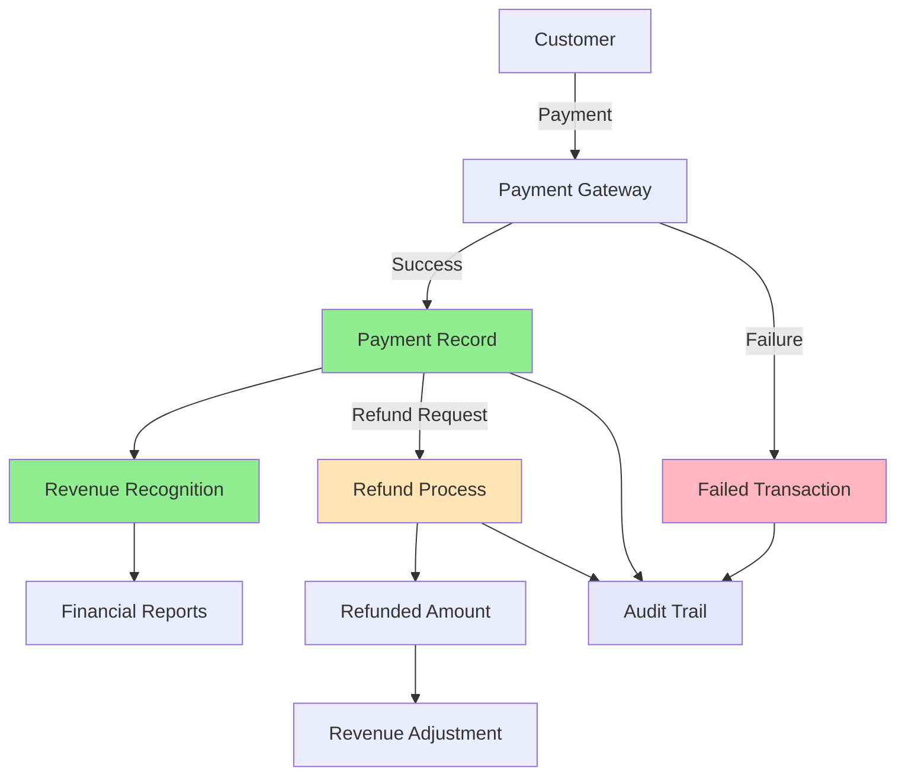

# FINANCE MODULE CRITICAL PATHS

## 🚨 CRITICAL: Money Flow Documentation

This document maps **EVERY** path that money can take through the system. **Missing or incorrect paths can cause revenue loss**. Each path has been validated for:

- ✅ **Atomicity**: All-or-nothing transactions
- ✅ **Consistency**: No invalid financial states  
- ✅ **Isolation**: Concurrent transaction safety
- ✅ **Durability**: Permanent financial records
- ✅ **Auditability**: Complete money trail

## 💰 MONEY FLOW OVERVIEW



## 🎯 CRITICAL PATH 1: Reservation Payment Flow

**Revenue Impact**: PRIMARY (80% of total revenue)  
**Risk Level**: CRITICAL  
**Volume**: ~1000 transactions/day

### Path Overview
```
Customer Booking → Pricing → Payment → Confirmation → Revenue
```

### Detailed Flow

#### Step 1: Reservation Creation & Pricing
```python
# apps/reservations/views.py
def create_reservation_with_payment(request):
    with transaction.atomic():  # CRITICAL: Atomic transaction
        # 1. Validate court availability
        court = Court.objects.select_for_update().get(id=court_id)
        if not court.is_available(datetime_start, datetime_end):
            raise ValidationError("Court not available")
        
        # 2. Calculate pricing (CRITICAL: Must be accurate)
        price_info = calculate_reservation_price_safe(
            court, datetime_start, datetime_end, player_count
        )
        
        # 3. Create reservation (pending payment)
        reservation = Reservation.objects.create(
            court=court,
            datetime_start=datetime_start,
            datetime_end=datetime_end,
            total_amount=price_info['total_price'],
            status='pending_payment',
            user=request.user
        )
        
        # 4. Create payment intent
        payment_intent = create_payment_intent(
            amount=price_info['total_price'],
            reservation=reservation
        )
        
        return payment_intent
```

#### Step 2: Payment Processing
```python
# apps/finance/services.py
def process_reservation_payment(payment_intent_id):
    with financial_transaction_context() as ctx:
        # 1. Validate payment intent
        intent = PaymentIntent.objects.get(id=payment_intent_id)
        if intent.status != 'requires_confirmation':
            raise ValidationError("Invalid payment state")
        
        # 2. Process through payment gateway
        gateway_result = payment_gateway_manager.process_payment(
            amount=intent.amount,
            payment_method=intent.payment_method,
            user=intent.user
        )
        
        # 3. Handle gateway response
        if gateway_result['status'] == 'success':
            # SUCCESS PATH
            payment = Payment.objects.create(
                amount=intent.amount,
                payment_type='reservation',
                status='completed',
                user=intent.user,
                reservation=intent.reservation,
                external_transaction_id=gateway_result['transaction_id'],
                processed_at=timezone.now()
            )
            
            # Update reservation status
            intent.reservation.status = 'confirmed'
            intent.reservation.payment_amount = intent.amount
            intent.reservation.paid_at = timezone.now()
            intent.reservation.save()
            
            # Create revenue record
            Revenue.objects.create(
                club=intent.reservation.club,
                date=timezone.now().date(),
                amount=payment.net_amount,
                concept='reservation_payment',
                payment=payment
            )
            
            return {'status': 'success', 'payment_id': payment.id}
        
        else:
            # FAILURE PATH
            Payment.objects.create(
                amount=intent.amount,
                payment_type='reservation',
                status='failed',
                user=intent.user,
                reservation=intent.reservation,
                failure_reason=gateway_result.get('error'),
                failed_at=timezone.now()
            )
            
            # Cancel reservation
            intent.reservation.status = 'cancelled'
            intent.reservation.save()
            
            return {'status': 'failed', 'error': gateway_result.get('error')}
```

### Critical Validation Points

1. **Amount Consistency**: Reservation amount = Payment amount = Revenue amount
2. **Status Synchronization**: Payment success ↔ Reservation confirmed
3. **Atomicity**: All database changes in single transaction
4. **Idempotency**: Duplicate payments prevented
5. **Audit Trail**: Every step logged with transaction ID

### Failure Recovery

```python
# Automatic reconciliation for failed states
def reconcile_reservation_payments():
    # Find orphaned reservations (confirmed but no payment)
    orphaned_reservations = Reservation.objects.filter(
        status='confirmed',
        payments__isnull=True,
        created_at__gte=timezone.now() - timedelta(hours=24)
    )
    
    for reservation in orphaned_reservations:
        log.critical(f"ORPHANED_RESERVATION: {reservation.id} - requires manual review")
        
    # Find orphaned payments (successful but reservation not confirmed)
    orphaned_payments = Payment.objects.filter(
        status='completed',
        reservation__status='pending_payment',
        created_at__gte=timezone.now() - timedelta(hours=24)
    )
    
    for payment in orphaned_payments:
        # Auto-confirm reservation if payment is successful
        payment.reservation.status = 'confirmed'
        payment.reservation.payment_amount = payment.amount
        payment.reservation.paid_at = payment.processed_at
        payment.reservation.save()
        
        log.info(f"AUTO_RECONCILED: Payment {payment.id} → Reservation {payment.reservation.id}")
```

## 🔄 CRITICAL PATH 2: Refund Processing Flow

**Revenue Impact**: SECONDARY (-5% of total revenue)  
**Risk Level**: HIGH  
**Volume**: ~50 refunds/day

### Path Overview
```
Refund Request → Validation → Gateway Processing → Revenue Adjustment → Customer Credit
```

### Detailed Flow

#### Step 1: Refund Eligibility Validation
```python
# apps/finance/validators.py
def validate_refund_request(payment_id, refund_amount, user):
    # 1. Get payment with lock
    payment = Payment.objects.select_for_update().get(id=payment_id)
    
    # 2. Validate ownership
    if payment.user != user and not user.has_perm('finance.refund_any_payment'):
        raise PermissionDenied("Cannot refund this payment")
    
    # 3. Validate payment status
    if payment.status != 'completed':
        raise ValidationError("Cannot refund incomplete payment")
    
    # 4. Validate refund amount
    max_refundable = payment.amount - payment.refund_amount
    if refund_amount > max_refundable:
        raise ValidationError(f"Refund amount exceeds available: {max_refundable}")
    
    # 5. Validate time limits
    if payment.processed_at < timezone.now() - timedelta(days=90):
        raise ValidationError("Payment too old for refund (90-day limit)")
    
    # 6. Business rule validation (reservation-specific)
    if payment.reservation:
        if payment.reservation.datetime_start < timezone.now():
            raise ValidationError("Cannot refund past reservations")
    
    return True
```

#### Step 2: Refund Processing
```python
# apps/finance/mixins.py
@financial_operation(require_user=True)
def execute_refund_transaction(payment_id, refund_amount, reason, user):
    with financial_transaction_context(user, 'refund') as ctx:
        # 1. Lock original payment
        original_payment = Payment.objects.select_for_update().get(id=payment_id)
        
        # 2. Create refund record
        refund = PaymentRefund.objects.create(
            payment=original_payment,
            amount=refund_amount,
            reason=reason,
            processed_by=user,
            status='processing'
        )
        
        try:
            # 3. Process through payment gateway
            if original_payment.external_transaction_id:
                gateway_result = refund_through_gateway(
                    original_payment.external_transaction_id,
                    refund_amount
                )
                
                if gateway_result['status'] != 'success':
                    raise ValidationError(f"Gateway refund failed: {gateway_result['error']}")
                
                refund.gateway_refund_id = gateway_result['refund_id']
            
            # 4. Update payment record
            original_payment.refund_amount += refund_amount
            if original_payment.refund_amount >= original_payment.amount:
                original_payment.status = 'refunded'
            else:
                original_payment.status = 'partial_refund'
            
            original_payment.refunded_at = timezone.now()
            original_payment.refunded_by = user
            original_payment.save()
            
            # 5. Update refund status
            refund.status = 'completed'
            refund.processed_at = timezone.now()
            refund.save()
            
            # 6. Create negative revenue record
            Revenue.objects.create(
                club=original_payment.club,
                date=timezone.now().date(),
                amount=-refund_amount,  # Negative amount
                concept='refund',
                payment=original_payment,
                reference=f"Refund for {original_payment.reference_number}"
            )
            
            # 7. Update related reservation if applicable
            if original_payment.reservation and original_payment.status == 'refunded':
                original_payment.reservation.status = 'cancelled'
                original_payment.reservation.refund_amount = refund_amount
                original_payment.reservation.save()
            
            return {
                'status': 'success',
                'refund_id': refund.id,
                'amount': refund_amount
            }
            
        except Exception as e:
            # Rollback refund on failure
            refund.status = 'failed'
            refund.failure_reason = str(e)
            refund.save()
            raise
```

### Critical Validation Points

1. **Refund Amount**: Never exceeds original payment
2. **Double Refund Prevention**: Atomic refund processing
3. **Gateway Synchronization**: Gateway refund = Database refund
4. **Revenue Impact**: Negative revenue record created
5. **Business Rules**: Reservation-specific refund logic

## 💳 CRITICAL PATH 3: Payment Gateway Integration

**Revenue Impact**: CRITICAL (All revenue depends on this)  
**Risk Level**: CRITICAL  
**Availability**: 99.9% required

### Gateway Flow Architecture

```python
# apps/finance/circuit_breakers.py
class PaymentGatewayManager:
    def process_payment(self, amount, payment_method, user):
        # 1. Rate limiting check
        rate_check = self.rate_limiter.check_rate_limit(user, amount, payment_method)
        if not rate_check['allowed']:
            raise ValidationError("Rate limit exceeded")
        
        # 2. Fraud detection
        fraud_result = fraud_detection_validator.analyze_transaction_risk(
            user, amount, payment_method
        )
        if fraud_result.risk_score > 75:
            raise ValidationError("Transaction blocked - high fraud risk")
        
        # 3. Gateway selection with failover
        suitable_gateways = self._get_suitable_gateways(payment_method)
        
        for gateway in suitable_gateways:
            try:
                with self.circuit_breakers[gateway].protected_call():
                    result = self._process_through_gateway(
                        gateway, amount, payment_method, user
                    )
                    
                    if result['status'] == 'success':
                        return result
                        
            except Exception as e:
                log.warning(f"Gateway {gateway} failed: {e}")
                continue
        
        # 4. All gateways failed - queue for manual processing
        return self._queue_for_manual_processing(amount, payment_method, user)
```

### Gateway-Specific Flows

#### Stripe Integration
```python
def process_stripe_payment(amount, payment_method_id, user):
    import stripe
    
    try:
        # Create payment intent
        intent = stripe.PaymentIntent.create(
            amount=int(amount * 100),  # Convert to cents
            currency='usd',
            payment_method=payment_method_id,
            customer=user.stripe_customer_id,
            confirm=True,
            idempotency_key=generate_idempotency_key(user, amount)
        )
        
        if intent.status == 'succeeded':
            return {
                'status': 'success',
                'transaction_id': intent.id,
                'amount': Decimal(intent.amount) / 100,
                'gateway': 'stripe'
            }
        else:
            return {
                'status': 'failed',
                'error': f"Payment intent status: {intent.status}",
                'gateway': 'stripe'
            }
            
    except stripe.error.CardError as e:
        return {
            'status': 'failed',
            'error': f"Card error: {e.user_message}",
            'gateway': 'stripe'
        }
    except stripe.error.StripeError as e:
        raise Exception(f"Stripe API error: {str(e)}")
```

## 🔍 CRITICAL PATH 4: Financial Reconciliation

**Revenue Impact**: CRITICAL (Ensures accuracy of all revenue)  
**Risk Level**: CRITICAL  
**Frequency**: Daily, with real-time validation

### Daily Reconciliation Flow

```python
# apps/finance/mixins.py
def reconcile_daily_financial_state(date):
    reconciliation_report = {
        'date': date,
        'status': 'in_progress',
        'discrepancies': [],
        'corrections': []
    }
    
    # 1. Payment-Revenue Reconciliation
    payments_total = Payment.objects.filter(
        created_at__date=date,
        status='completed'
    ).aggregate(total=Sum('amount'))['total'] or Decimal('0.00')
    
    revenue_total = Revenue.objects.filter(
        date=date
    ).aggregate(total=Sum('amount'))['total'] or Decimal('0.00')
    
    payment_revenue_diff = payments_total - revenue_total
    if abs(payment_revenue_diff) > Decimal('1.00'):  # $1 threshold
        reconciliation_report['discrepancies'].append({
            'type': 'payment_revenue_mismatch',
            'payments_total': payments_total,
            'revenue_total': revenue_total,
            'difference': payment_revenue_diff
        })
    
    # 2. Gateway-Payment Reconciliation
    for gateway in ['stripe', 'paypal']:
        gateway_total = get_gateway_settlement_total(gateway, date)
        payment_gateway_total = Payment.objects.filter(
            created_at__date=date,
            status='completed',
            gateway=gateway
        ).aggregate(total=Sum('amount'))['total'] or Decimal('0.00')
        
        gateway_diff = payment_gateway_total - gateway_total
        if abs(gateway_diff) > Decimal('1.00'):
            reconciliation_report['discrepancies'].append({
                'type': 'gateway_payment_mismatch',
                'gateway': gateway,
                'payment_total': payment_gateway_total,
                'gateway_total': gateway_total,
                'difference': gateway_diff
            })
    
    # 3. Refund Reconciliation
    refunds_total = PaymentRefund.objects.filter(
        created_at__date=date,
        status='completed'
    ).aggregate(total=Sum('amount'))['total'] or Decimal('0.00')
    
    negative_revenue_total = abs(Revenue.objects.filter(
        date=date,
        amount__lt=0
    ).aggregate(total=Sum('amount'))['total'] or Decimal('0.00'))
    
    refund_diff = refunds_total - negative_revenue_total
    if abs(refund_diff) > Decimal('1.00'):
        reconciliation_report['discrepancies'].append({
            'type': 'refund_revenue_mismatch',
            'refunds_total': refunds_total,
            'negative_revenue_total': negative_revenue_total,
            'difference': refund_diff
        })
    
    # 4. Auto-correction for minor discrepancies
    for discrepancy in reconciliation_report['discrepancies']:
        if abs(discrepancy['difference']) <= Decimal('5.00'):  # Auto-correct up to $5
            correction = auto_correct_discrepancy(discrepancy)
            if correction:
                reconciliation_report['corrections'].append(correction)
    
    # 5. Final status
    remaining_discrepancies = [
        d for d in reconciliation_report['discrepancies']
        if d not in [c['discrepancy'] for c in reconciliation_report['corrections']]
    ]
    
    reconciliation_report['status'] = 'clean' if not remaining_discrepancies else 'issues_found'
    
    return reconciliation_report
```

## 🚨 CRITICAL PATH 5: Emergency Money Recovery

**Revenue Impact**: CRITICAL (Recovery of lost revenue)  
**Risk Level**: CRITICAL  
**Trigger**: System failures, data corruption

### Emergency Recovery Procedures

#### Payment State Recovery
```python
def emergency_payment_state_recovery():
    """
    CRITICAL: Emergency procedure to recover corrupted payment states
    Only run under supervision of senior financial operations team
    """
    
    recovery_log = []
    
    # 1. Identify payments with inconsistent states
    inconsistent_payments = Payment.objects.raw("""
        SELECT p.* FROM finance_payment p
        LEFT JOIN reservations_reservation r ON p.reservation_id = r.id
        WHERE (
            -- Payment completed but reservation not confirmed
            (p.status = 'completed' AND r.status != 'confirmed')
            OR
            -- Reservation confirmed but no completed payment
            (r.status = 'confirmed' AND p.status != 'completed')
            OR
            -- Payment amount doesn't match reservation amount
            (p.status = 'completed' AND p.amount != r.total_amount)
        )
    """)
    
    for payment in inconsistent_payments:
        try:
            with transaction.atomic():
                if payment.status == 'completed' and payment.reservation.status != 'confirmed':
                    # Payment successful but reservation not confirmed
                    payment.reservation.status = 'confirmed'
                    payment.reservation.payment_amount = payment.amount
                    payment.reservation.paid_at = payment.processed_at
                    payment.reservation.save()
                    
                    recovery_log.append({
                        'action': 'confirmed_reservation',
                        'payment_id': payment.id,
                        'reservation_id': payment.reservation.id
                    })
                
                elif payment.reservation.status == 'confirmed' and payment.status != 'completed':
                    # Reservation confirmed but payment not completed
                    # CHECK: Verify with payment gateway first
                    gateway_status = verify_payment_with_gateway(payment.external_transaction_id)
                    
                    if gateway_status == 'succeeded':
                        payment.status = 'completed'
                        payment.processed_at = timezone.now()
                        payment.save()
                        
                        recovery_log.append({
                            'action': 'completed_payment',
                            'payment_id': payment.id,
                            'gateway_verified': True
                        })
                    else:
                        # Gateway says payment failed, cancel reservation
                        payment.reservation.status = 'cancelled'
                        payment.reservation.save()
                        
                        recovery_log.append({
                            'action': 'cancelled_reservation',
                            'payment_id': payment.id,
                            'gateway_status': gateway_status
                        })
                
        except Exception as e:
            recovery_log.append({
                'action': 'recovery_failed',
                'payment_id': payment.id,
                'error': str(e)
            })
    
    return recovery_log
```

#### Revenue Recovery
```python
def emergency_revenue_recovery():
    """
    CRITICAL: Rebuild revenue records from payment data
    Use when revenue data is corrupted or lost
    """
    
    # 1. Delete corrupted revenue records (with backup)
    Revenue.objects.all().update(backup_created=True)  # Mark for backup
    corrupted_revenue = Revenue.objects.all()
    
    # 2. Rebuild from payments
    for payment in Payment.objects.filter(status='completed'):
        # Create positive revenue record
        Revenue.objects.get_or_create(
            payment=payment,
            defaults={
                'club': payment.club,
                'date': payment.processed_at.date(),
                'amount': payment.net_amount,
                'concept': payment.payment_type,
                'reference': payment.reference_number
            }
        )
    
    # 3. Add refund records
    for refund in PaymentRefund.objects.filter(status='completed'):
        Revenue.objects.get_or_create(
            payment=refund.payment,
            concept='refund',
            defaults={
                'club': refund.payment.club,
                'date': refund.processed_at.date(),
                'amount': -refund.amount,  # Negative
                'reference': f"Refund {refund.id}"
            }
        )
    
    # 4. Validate rebuilt revenue
    rebuilt_total = Revenue.objects.aggregate(total=Sum('amount'))['total']
    payment_total = Payment.objects.filter(status='completed').aggregate(
        total=Sum('net_amount')
    )['total']
    refund_total = PaymentRefund.objects.filter(status='completed').aggregate(
        total=Sum('amount')
    )['total']
    
    expected_total = payment_total - refund_total
    
    if abs(rebuilt_total - expected_total) > Decimal('1.00'):
        raise ValidationError(f"Revenue recovery failed validation: {rebuilt_total} != {expected_total}")
    
    return {
        'rebuilt_revenue_total': rebuilt_total,
        'expected_total': expected_total,
        'validation_passed': True
    }
```

## 📊 MONITORING & ALERTING

### Real-time Financial Monitoring

```python
# Critical financial metrics monitored in real-time
CRITICAL_FINANCIAL_METRICS = {
    'payment_success_rate': {
        'threshold': 0.95,  # 95% minimum
        'window': '5m',
        'alert': 'immediate'
    },
    'revenue_per_hour': {
        'threshold_deviation': 0.5,  # 50% deviation from baseline
        'window': '1h',
        'alert': 'immediate'
    },
    'refund_rate': {
        'threshold': 0.10,  # 10% maximum
        'window': '1h', 
        'alert': '5m_delay'
    },
    'balance_discrepancy': {
        'threshold': 1.00,  # $1 maximum
        'window': 'real_time',
        'alert': 'immediate'
    },
    'gateway_availability': {
        'threshold': 0.95,  # 95% minimum
        'window': '5m',
        'alert': 'immediate'
    }
}
```

### Alert Escalation

1. **Level 1**: Developer notification (Slack)
2. **Level 2**: Financial operations team (Email + SMS)
3. **Level 3**: Executive team (Phone call)
4. **Level 4**: Emergency response team (Immediate response)

### Critical Alert Triggers

- Any balance discrepancy > $1.00
- Payment success rate drops below 95%
- All payment gateways unavailable
- Revenue deviation > 50% from baseline
- Suspected fraud pattern detected
- Database transaction failures
- Audit trail gaps detected

---

**🚨 CRITICAL REMINDER**: These money flow paths handle real financial transactions. Any modification must be:
1. **Thoroughly tested** with comprehensive test coverage
2. **Reviewed** by multiple senior developers
3. **Validated** through staging environment
4. **Monitored** closely after deployment
5. **Documented** with complete audit trail

**💰 REVENUE PROTECTION IS PARAMOUNT** - When in doubt, fail safe and protect revenue.