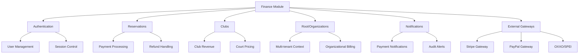

# FINANCE MODULE DEPENDENCIES

## CRITICAL: Financial System Integration Points

This document maps all critical dependencies and integration points for the finance module. **Every dependency must be secure and reliable** as they handle real money transactions.

## 📊 DEPENDENCY OVERVIEW



## 🔗 CORE DEPENDENCIES

### 1. Authentication Module (`apps.authentication`)

**Dependency Type**: CRITICAL  
**Risk Level**: HIGH  
**Impact on Finance**: User verification and session security

#### Integration Points:
- **User Model**: All payments must be linked to authenticated users
- **Session Management**: Financial operations require active, secure sessions
- **Permission Checks**: Payment access control and authorization
- **2FA Integration**: High-value transactions may require additional authentication

#### Code Dependencies:
```python
# Financial operations depend on user authentication
from django.contrib.auth import get_user_model
from apps.authentication.models import UserProfile

# Session validation for financial security
from apps.authentication.middleware import FinancialSessionMiddleware

# Permission checks for payment operations
from apps.authentication.permissions import PaymentPermissions
```

#### Critical Requirements:
- ✅ User sessions must be validated before financial operations
- ✅ Session timeout must trigger financial operation cancellation
- ✅ User roles must determine payment access levels
- ✅ 2FA integration for high-value transactions (>$1000)

#### Risk Factors:
- 🚨 **Session hijacking** could lead to unauthorized payments
- 🚨 **Authentication bypass** could compromise payment security
- 🚨 **User privilege escalation** could access wrong financial data

### 2. Reservations Module (`apps.reservations`)

**Dependency Type**: CRITICAL  
**Risk Level**: MEDIUM  
**Impact on Finance**: Primary revenue source through reservation payments

#### Integration Points:
- **Payment Processing**: Reservations trigger payment creation
- **Refund Management**: Cancelled reservations require refund processing
- **Pricing Calculation**: Court pricing affects payment amounts
- **Status Synchronization**: Payment status must sync with reservation status

#### Code Dependencies:
```python
# Reservation payment processing
from apps.reservations.models import Reservation
from apps.reservations.services import ReservationPaymentService

# Court pricing for payment calculation
from apps.reservations.mixins import ReservationSafetyMixin
```

#### Financial Flows:
1. **Reservation Creation** → Payment Intent Creation
2. **Payment Success** → Reservation Confirmation
3. **Payment Failure** → Reservation Cancellation
4. **Reservation Cancellation** → Refund Processing

#### Critical Requirements:
- ✅ Reservation payments must be atomic with reservation creation
- ✅ Failed payments must not leave confirmed reservations
- ✅ Refund eligibility must follow reservation cancellation rules
- ✅ Pricing changes must not affect pending payments

#### Risk Factors:
- 💰 **Pricing inconsistency** could cause revenue loss
- 💰 **Double booking** could lead to payment disputes
- 💰 **Refund abuse** could impact revenue

### 3. Clubs Module (`apps.clubs`)

**Dependency Type**: HIGH  
**Risk Level**: MEDIUM  
**Impact on Finance**: Club-specific financial configuration and revenue tracking

#### Integration Points:
- **Multi-tenant Context**: Payments must be scoped to correct club
- **Club Configuration**: Payment settings and gateway configurations
- **Revenue Tracking**: Club-specific financial reporting
- **Court Pricing**: Club-specific pricing rules

#### Code Dependencies:
```python
# Club financial configuration
from apps.clubs.models import Club, Court
from apps.clubs.mixins import DefensiveQueryMixin

# Club-specific payment processing
from apps.clubs.services import ClubFinancialService
```

#### Financial Flows:
1. **Club Revenue** → Payment Aggregation
2. **Court Pricing** → Payment Calculation
3. **Club Settings** → Payment Gateway Configuration
4. **Club Reports** → Financial Analytics

#### Critical Requirements:
- ✅ All payments must be correctly attributed to clubs
- ✅ Club isolation must prevent cross-club payment access
- ✅ Club-specific pricing must be enforced
- ✅ Revenue reporting must be accurate per club

#### Risk Factors:
- 🏢 **Multi-tenant leakage** could expose financial data between clubs
- 🏢 **Pricing configuration errors** could cause revenue loss
- 🏢 **Club deletion** must handle existing payments safely

### 4. Root/Organizations Module (`apps.root`)

**Dependency Type**: HIGH  
**Risk Level**: LOW  
**Impact on Finance**: Organizational billing and top-level financial oversight

#### Integration Points:
- **Organization Context**: Top-level financial aggregation
- **Billing Management**: Organization-wide payment processing
- **Multi-tenant Security**: Organization isolation for payments
- **Administrative Oversight**: Organization-level financial controls

#### Code Dependencies:
```python
# Organizational financial context
from apps.root.models import Organization
from apps.root.services import OrganizationBillingService

# Multi-tenant financial isolation
from apps.root.mixins import OrganizationMixin
```

#### Financial Flows:
1. **Organization Billing** → Aggregate Payment Processing
2. **Organization Reports** → Financial Analytics
3. **Organization Settings** → Payment Configuration
4. **Organization Limits** → Payment Validation

#### Critical Requirements:
- ✅ Organization isolation must be enforced in all financial operations
- ✅ Organization-level billing must aggregate correctly
- ✅ Organization deletion must handle financial data safely
- ✅ Organization limits must prevent payment abuse

### 5. Notifications Module (`apps.notifications`)

**Dependency Type**: MEDIUM  
**Risk Level**: LOW  
**Impact on Finance**: Payment status communication and audit alerts

#### Integration Points:
- **Payment Notifications**: Success/failure notifications
- **Audit Alerts**: Security and fraud detection alerts
- **Refund Notifications**: Refund processing updates
- **System Alerts**: Financial system health notifications

#### Code Dependencies:
```python
# Payment notifications
from apps.notifications.services import PaymentNotificationService
from apps.notifications.models import NotificationTemplate

# Audit and security alerts
from apps.notifications.services import AuditAlertService
```

#### Notification Types:
1. **Payment Success** → User + Admin Notification
2. **Payment Failure** → User + Admin Alert
3. **Refund Processed** → User Notification
4. **Fraud Detected** → Admin Alert
5. **System Health** → Admin Alert

#### Critical Requirements:
- ✅ Payment notifications must be sent reliably
- ✅ Audit alerts must be immediate for security issues
- ✅ Notification failures must not affect payment processing
- ✅ Sensitive financial data must not appear in notifications

## 🌐 EXTERNAL DEPENDENCIES

### Payment Gateways

#### Stripe Integration
**Service**: Primary card payment processing  
**Risk Level**: HIGH  
**Fallback**: PayPal, Manual Processing

- **Webhook Handling**: Payment status updates
- **Idempotency**: Duplicate payment prevention
- **Security**: PCI compliance requirements
- **Rate Limits**: Transaction volume limitations

#### PayPal Integration
**Service**: Alternative payment method  
**Risk Level**: MEDIUM  
**Fallback**: Manual Processing

- **OAuth**: Secure payment authorization
- **Currency Support**: Multi-currency handling
- **Dispute Management**: Chargeback processing

#### OXXO/SPEI (Mexico)
**Service**: Cash and bank transfer payments  
**Risk Level**: LOW  
**Fallback**: Manual Processing

- **Voucher Generation**: Payment reference creation
- **Status Polling**: Payment confirmation checking
- **Settlement**: Bank integration for transfers

### Infrastructure Dependencies

#### Database (PostgreSQL)
**Service**: Financial data storage  
**Risk Level**: CRITICAL  
**Backup**: Real-time replication

- **ACID Transactions**: Data consistency
- **Encryption**: Data at rest security
- **Performance**: Query optimization
- **Backup**: Point-in-time recovery

#### Cache (Redis)
**Service**: Session and rate limiting  
**Risk Level**: MEDIUM  
**Fallback**: Database storage

- **Session Storage**: Financial session management
- **Rate Limiting**: Payment abuse prevention
- **Circuit Breaker States**: Gateway health tracking

#### Message Queue (Celery/Redis)
**Service**: Async payment processing  
**Risk Level**: MEDIUM  
**Fallback**: Synchronous processing

- **Payment Processing**: Background transaction handling
- **Notification Delivery**: Async notification sending
- **Reconciliation**: Scheduled financial validation

## 📋 DEPENDENCY MONITORING

### Health Checks

```bash
# Run comprehensive dependency health check
./scripts/validate_finance_module.sh

# Individual dependency checks
python manage.py check_finance_dependencies
python manage.py validate_payment_gateways
python manage.py test_financial_integrations
```

### Monitoring Metrics

1. **Authentication Integration**
   - Session validation success rate: >99%
   - User authentication latency: <100ms
   - Permission check accuracy: 100%

2. **Reservation Integration**
   - Payment-reservation sync rate: 100%
   - Pricing calculation accuracy: 100%
   - Refund processing time: <5 minutes

3. **External Gateway Health**
   - Gateway availability: >95%
   - Payment success rate: >98%
   - Response time: <3 seconds

### Failure Scenarios

#### Authentication Failure
- **Impact**: No new payments can be processed
- **Mitigation**: Queue payments for later processing
- **Recovery**: Automatic retry with backoff

#### Reservation Module Failure
- **Impact**: New reservation payments fail
- **Mitigation**: Accept payments, manual reservation creation
- **Recovery**: Sync payments with reservations on recovery

#### Payment Gateway Failure
- **Impact**: Specific payment method unavailable
- **Mitigation**: Automatic failover to backup gateway
- **Recovery**: Circuit breaker automatic recovery

#### Database Failure
- **Impact**: All financial operations stop
- **Mitigation**: Failover to read replica (read-only mode)
- **Recovery**: Database cluster recovery

## 🚨 SECURITY CONSIDERATIONS

### Cross-Module Security

1. **Data Validation**
   - All financial data must be validated at module boundaries
   - Sanitization required for external data
   - Type safety enforcement for monetary values

2. **Access Control**
   - Role-based access control for financial operations
   - Club isolation for multi-tenant security
   - Admin override capabilities with audit logging

3. **Audit Trail**
   - All cross-module financial operations must be logged
   - Immutable audit records required
   - Real-time monitoring for suspicious patterns

### Integration Security

```python
# Example secure integration pattern
@financial_operation(require_user=True, max_amount=Decimal('10000.00'))
def process_reservation_payment(reservation_id, user):
    # Validate user can access reservation
    reservation = get_reservation_safe(reservation_id, user)
    if not reservation:
        raise PermissionDenied("Cannot access reservation")
    
    # Validate reservation is payable
    if reservation.status != 'pending_payment':
        raise ValidationError("Reservation not in payable state")
    
    # Process payment with full audit
    with financial_transaction_context(user, 'reservation_payment'):
        return execute_financial_transaction(
            amount=reservation.total_amount,
            transaction_type='payment',
            reference_id=str(reservation.id),
            user=user
        )
```

## 🔄 DEPENDENCY UPDATE PROCEDURES

### Breaking Changes

When dependencies introduce breaking changes:

1. **Assessment Phase**
   - Identify affected financial operations
   - Assess revenue impact risk
   - Plan rollback procedures

2. **Testing Phase**
   - Run full financial test suite
   - Validate integration points
   - Test failure scenarios

3. **Deployment Phase**
   - Deploy during low-traffic period
   - Monitor financial metrics closely
   - Have rollback plan ready

### Version Compatibility

Maintain compatibility matrix:
```yaml
finance_module: "2.0.0"
compatible_versions:
  authentication: ">=1.5.0,<2.0.0"
  reservations: ">=1.3.0,<2.0.0"
  clubs: ">=1.4.0,<2.0.0"
  root: ">=1.2.0,<2.0.0"
  notifications: ">=1.1.0,<2.0.0"
```

## 📝 CHANGE MANAGEMENT

### Dependency Change Approval

All financial dependency changes require:

1. **Technical Review**
   - Architecture impact assessment
   - Security vulnerability analysis
   - Performance impact evaluation

2. **Business Review**
   - Revenue impact assessment
   - Compliance requirement validation
   - Risk mitigation planning

3. **Testing Requirements**
   - Full integration test suite
   - Load testing under realistic conditions
   - Disaster recovery testing

### Documentation Requirements

For each dependency change:
- Update this dependency document
- Update integration test coverage
- Update monitoring and alerting
- Update operational runbooks

---

**⚠️ CRITICAL REMINDER**: The finance module handles real money. Any change to dependencies must be thoroughly tested and reviewed. When in doubt, err on the side of caution and require additional review before deployment.