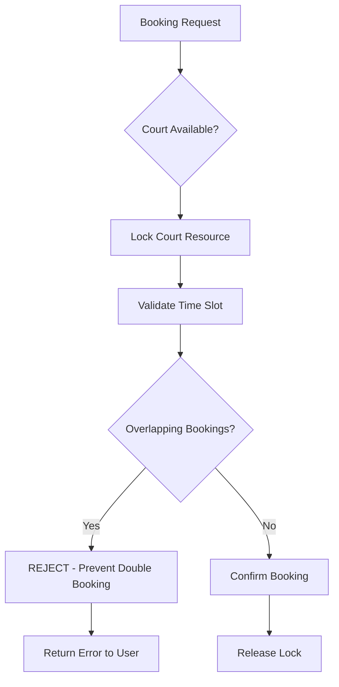
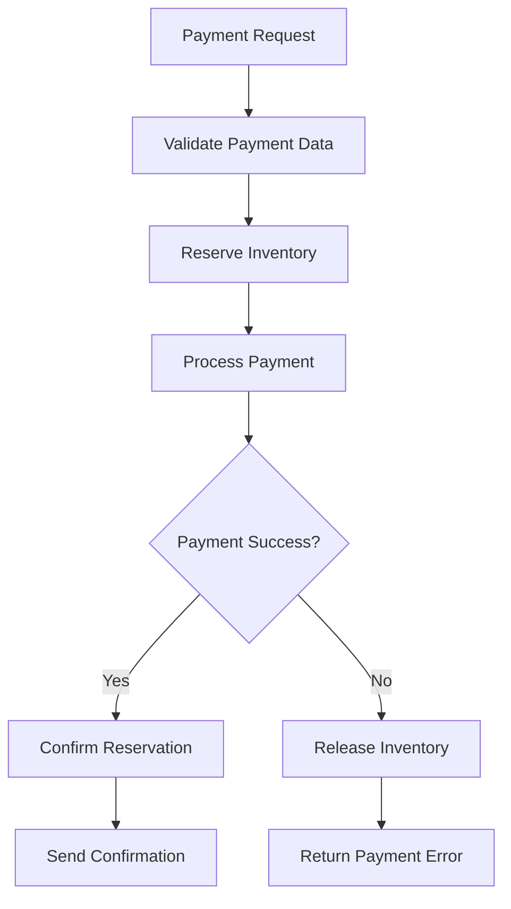
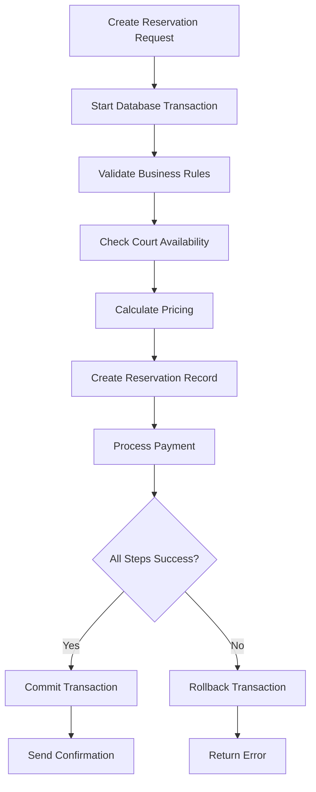
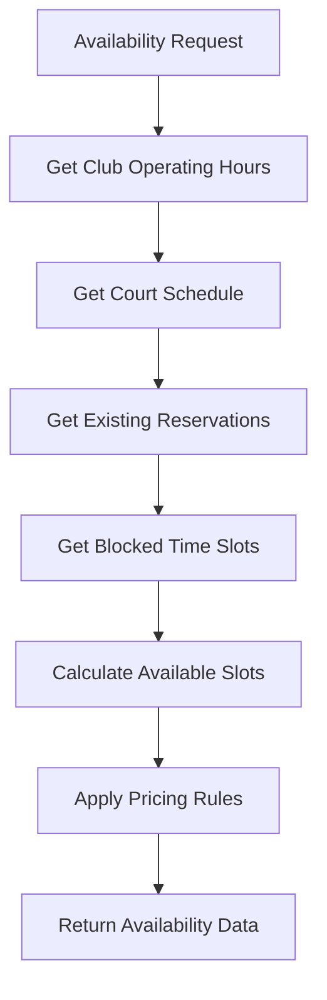
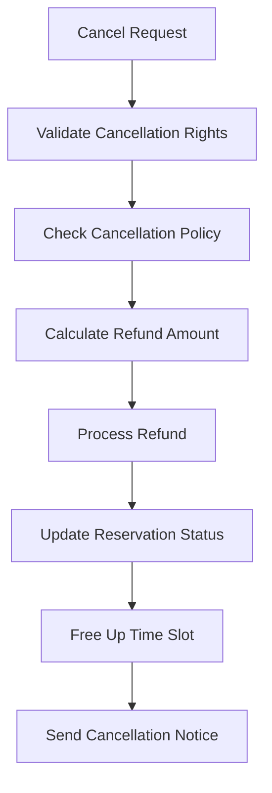
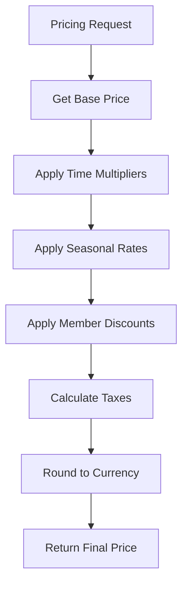
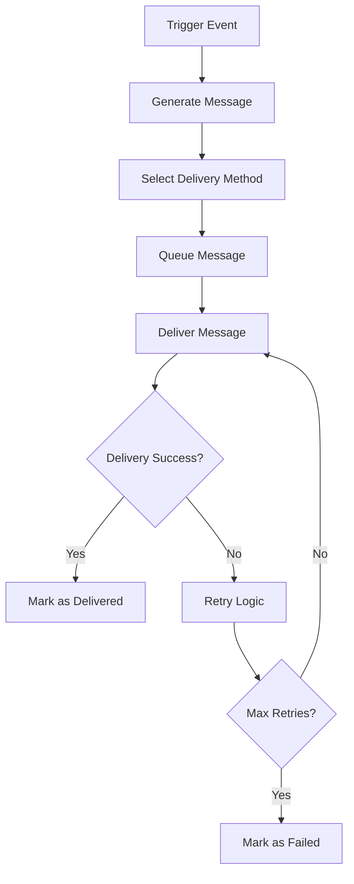
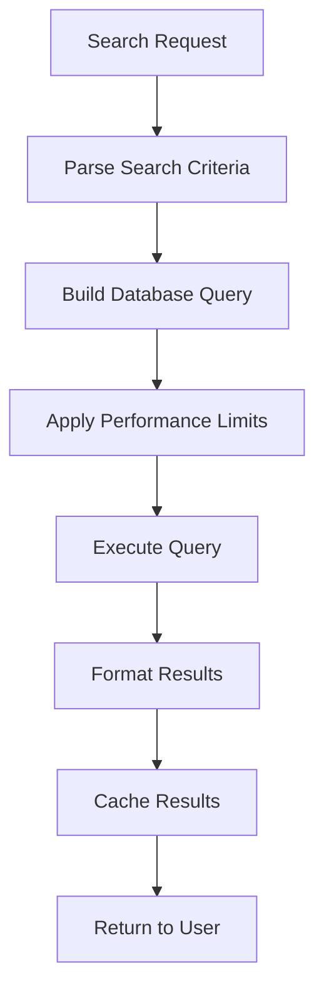
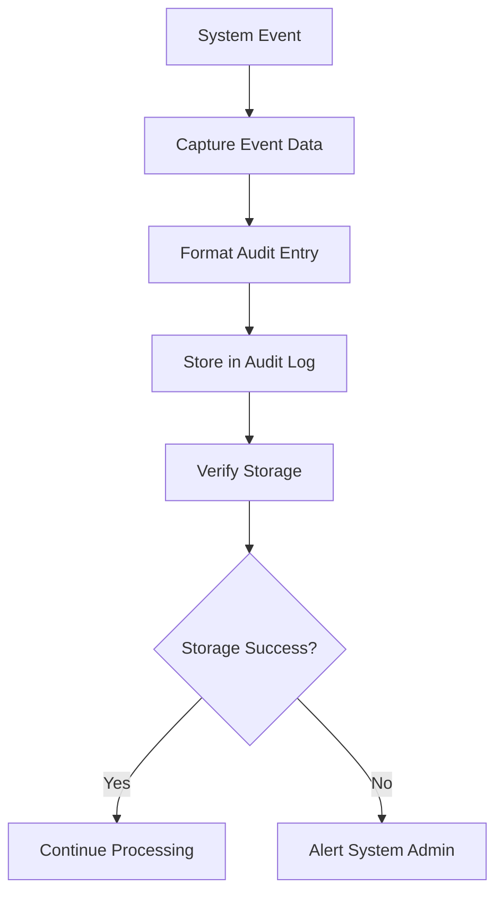

# RESERVATIONS CRITICAL PATHS

**Version**: 1.0.0  
**Last Updated**: 2025-08-08  
**Module**: Reservations (apps.reservations)  
**Status**: 🔴 MISSION CRITICAL

## 🚨 CRITICAL SYSTEM OVERVIEW

This document defines the **ABSOLUTE CRITICAL** paths in the reservations module that **MUST NEVER FAIL**. These paths directly impact revenue, user experience, and business operations.

**⚠️ IMPORTANT**: Any failure in these paths can result in:
- **Revenue Loss** 💰
- **Customer Dissatisfaction** 😠
- **Double Bookings** ⚠️
- **Business Reputation Damage** 📉

## 🎯 CRITICALITY LEVELS

### 🔴 LEVEL 1 - ABSOLUTE CRITICAL
**Impact**: Immediate revenue loss or system failure  
**SLA**: 99.99% uptime  
**Response Time**: < 500ms  
**Recovery Time**: < 30 seconds

### 🟠 LEVEL 2 - BUSINESS CRITICAL  
**Impact**: Degraded user experience  
**SLA**: 99.9% uptime  
**Response Time**: < 2 seconds  
**Recovery Time**: < 2 minutes

### 🟡 LEVEL 3 - OPERATIONAL CRITICAL
**Impact**: Reduced functionality  
**SLA**: 99.5% uptime  
**Response Time**: < 5 seconds  
**Recovery Time**: < 5 minutes

---

## 🔴 LEVEL 1 CRITICAL PATHS

### 1. DOUBLE BOOKING PREVENTION 🔒

**Why Critical**: Prevents revenue loss and customer disputes



**Implementation**:
```python
# apps/reservations/mixins.py - ReservationSafetyMixin
def prevent_double_booking(self, court, datetime_start, datetime_end):
    with transaction.atomic():
        # CRITICAL: Pessimistic locking to prevent race conditions
        locked_court = Court.objects.select_for_update().get(id=court.id)
        
        overlapping = Reservation.objects.filter(
            court=locked_court,
            status__in=['confirmed', 'pending'],
            datetime_start__lt=datetime_end,
            datetime_end__gt=datetime_start
        ).exists()
        
        if overlapping:
            raise ValidationError('Court already booked')
        
        return True
```

**Failure Scenarios**:
- Database deadlock
- Transaction timeout
- Concurrent access race condition

**Monitoring**:
- **Alert**: Any double booking detected
- **Metric**: Booking conflict rate = 0%
- **Check**: Every booking transaction

### 2. PAYMENT PROCESSING INTEGRITY 💳

**Why Critical**: Direct revenue impact



**Implementation**:
```python
# apps/reservations/circuit_breakers.py
def process_payment_with_breaker(self, reservation, payment_data):
    return self.get_breaker('payment_processing').call_with_breaker(
        self._process_payment_internal, reservation, payment_data
    )
```

**Failure Scenarios**:
- Payment gateway timeout
- Network connectivity issues
- Invalid payment credentials
- Insufficient funds

**Monitoring**:
- **Alert**: Payment success rate < 99%
- **Metric**: Payment processing time < 30s
- **Check**: Every payment transaction

### 3. RESERVATION CREATION ATOMICITY ⚛️

**Why Critical**: Data consistency and user trust



**Implementation**:
```python
# apps/reservations/mixins.py
@transaction.atomic
def create_reservation_atomic(self, reservation_data):
    # CRITICAL: All-or-nothing operation
    try:
        # Validate time constraints
        time_validation = self.validate_reservation_time_safe(...)
        if not time_validation['is_valid']:
            raise ValidationError(time_validation['errors'])
        
        # Prevent double booking
        self.prevent_double_booking(...)
        
        # Create reservation
        reservation = Reservation.objects.create(**reservation_data)
        
        # Invalidate caches
        self.invalidate_reservation_caches(...)
        
        return reservation
        
    except Exception as e:
        logger.error(f'Atomic reservation creation failed: {e}')
        raise
```

**Failure Scenarios**:
- Database constraint violation
- Business rule validation failure
- Payment processing failure
- Network timeout

**Monitoring**:
- **Alert**: Reservation creation failure rate > 1%
- **Metric**: Creation time < 2 seconds
- **Check**: Every reservation attempt

---

## 🟠 LEVEL 2 CRITICAL PATHS

### 4. COURT AVAILABILITY CALCULATION 📅

**Why Critical**: Affects all booking decisions



**Implementation**:
```python
# apps/reservations/circuit_breakers.py
def check_availability_with_breaker(self, court, date, start_time, end_time):
    return self.get_breaker('availability_check').call_with_breaker(
        self._check_availability_internal, court, date, start_time, end_time
    )
```

**Performance Requirements**:
- Response time < 500ms
- Cache hit rate > 80%
- Accuracy 100%

**Monitoring**:
- **Alert**: Response time > 1 second
- **Metric**: Cache effectiveness
- **Check**: Every availability request

### 5. RESERVATION CANCELLATION WORKFLOW ❌

**Why Critical**: Affects revenue and customer satisfaction



**Implementation**:
```python
# apps/reservations/mixins.py
def cancel_reservation_safe(self, reservation, reason='user_requested'):
    with transaction.atomic():
        # Lock reservation for update
        locked_reservation = Reservation.objects.select_for_update().get(
            id=reservation.id
        )
        
        if locked_reservation.status in ['cancelled', 'completed']:
            raise ValidationError('Cannot cancel reservation')
        
        # Update status atomically
        locked_reservation.status = 'cancelled'
        locked_reservation.cancelled_at = timezone.now()
        locked_reservation.save()
        
        # Invalidate availability cache
        self.invalidate_reservation_caches(...)
        
        return locked_reservation
```

**Business Rules**:
- Validate cancellation deadline
- Calculate refund amount
- Apply cancellation fees
- Update availability

**Monitoring**:
- **Alert**: Cancellation processing failure
- **Metric**: Cancellation time < 5 seconds
- **Check**: Every cancellation

### 6. PRICING CALCULATION ENGINE 💰

**Why Critical**: Affects revenue accuracy



**Implementation**:
```python
# apps/reservations/mixins.py
def calculate_reservation_price_safe(self, court, datetime_start, datetime_end):
    try:
        duration_hours = (datetime_end - datetime_start).total_seconds() / 3600
        base_price = getattr(court, 'price_per_hour', Decimal('50.00'))
        
        # Apply multipliers safely
        multiplier = self._get_time_multiplier(datetime_start)
        total_price = base_price * Decimal(str(duration_hours)) * multiplier
        
        return {
            'total_price': total_price,
            'currency': 'EUR',
            'breakdown': {...}
        }
        
    except Exception as e:
        logger.error(f'Pricing calculation error: {e}')
        return {
            'total_price': Decimal('50.00'),  # Safe fallback
            'error': 'Used default pricing'
        }
```

**Accuracy Requirements**:
- Price calculation must be exact
- Fallback to safe defaults
- Audit trail for all calculations

**Monitoring**:
- **Alert**: Pricing calculation errors
- **Metric**: Calculation time < 100ms
- **Check**: Random price verification

---

## 🟡 LEVEL 3 CRITICAL PATHS

### 7. NOTIFICATION DELIVERY SYSTEM 📧

**Why Critical**: Customer communication and experience



**Implementation**:
```python
# apps/reservations/circuit_breakers.py
def send_notification_with_breaker(self, reservation, notification_type):
    return self.get_breaker('notification').call_with_breaker(
        self._send_notification_internal, reservation, notification_type
    )
```

**Delivery Requirements**:
- Booking confirmation: 99% delivery
- Cancellation notice: 99% delivery
- Reminder messages: 95% delivery

**Monitoring**:
- **Alert**: Delivery rate < 90%
- **Metric**: Average delivery time
- **Check**: Daily delivery reports

### 8. RESERVATION SEARCH AND FILTERING 🔍

**Why Critical**: User experience and system performance



**Performance Requirements**:
- Search response < 1 second
- Support pagination
- Cache frequent searches

**Monitoring**:
- **Alert**: Search time > 2 seconds
- **Metric**: Search performance
- **Check**: Query optimization

### 9. AUDIT TRAIL MAINTENANCE 📋

**Why Critical**: Compliance and troubleshooting



**Audit Requirements**:
- All reservation changes logged
- Payment events tracked
- User actions recorded
- System errors captured

**Monitoring**:
- **Alert**: Audit log failures
- **Metric**: Audit completeness
- **Check**: Daily audit verification

---

## 🔧 FAILURE RECOVERY PROCEDURES

### Immediate Response (< 30 seconds)

1. **Activate Circuit Breakers**
   ```python
   # Automatic protection
   if failure_count >= threshold:
       circuit_breaker.open()
   ```

2. **Enable Fallback Modes**
   - Payment: Queue for manual processing
   - Availability: Conservative blocking
   - Notifications: Queue for retry

3. **Alert Escalation**
   - Level 1: Immediate pager
   - Level 2: SMS + Email
   - Level 3: Email notification

### Short-term Recovery (< 2 minutes)

1. **Database Failover**
   ```bash
   # Switch to backup database
   ./scripts/failover_database.sh
   ```

2. **Service Restart**
   ```bash
   # Restart affected services
   systemctl restart reservation-service
   ```

3. **Clear Problematic Cache**
   ```python
   # Clear affected caches
   cache.delete_pattern('reservation_*')
   ```

### Long-term Recovery (< 5 minutes)

1. **Full System Check**
   ```bash
   # Run comprehensive validation
   ./scripts/validate_reservations_module.sh
   ```

2. **Data Integrity Verification**
   ```python
   # Check for data inconsistencies
   validator = ReservationIntegrityValidator()
   results = validator.validate_all_reservations()
   ```

3. **Performance Optimization**
   ```sql
   -- Rebuild indexes if needed
   REINDEX TABLE reservations_reservation;
   ```

---

## 📊 MONITORING AND METRICS

### Real-time Dashboards

**Primary Metrics** (Update every 30 seconds):
- Active reservations count
- Payment success rate
- Double booking incidents
- System response times

**Secondary Metrics** (Update every 5 minutes):
- Circuit breaker states
- Cache hit rates
- Error rates by component
- User satisfaction scores

### Alerting Rules

```yaml
# Critical Alerts (Immediate)
double_booking_detected:
  condition: booking_conflicts > 0
  severity: critical
  notification: pager + sms + email

payment_failure_rate:
  condition: payment_success_rate < 99%
  severity: critical
  notification: pager + sms

# Warning Alerts (5 minutes)
high_response_time:
  condition: avg_response_time > 1000ms
  severity: warning
  notification: email

low_cache_hit_rate:
  condition: cache_hit_rate < 80%
  severity: warning
  notification: email
```

### Health Checks

```python
# Every 30 seconds
def critical_health_check():
    checks = {
        'database': check_database_connectivity(),
        'payment_gateway': check_payment_service(),
        'cache': check_cache_availability(),
        'circuit_breakers': check_breaker_states()
    }
    
    if any(not status for status in checks.values()):
        trigger_emergency_response()
        
    return checks
```

---

## 🧪 TESTING CRITICAL PATHS

### Automated Testing (Every Deployment)

```python
# Critical path integration tests
def test_end_to_end_booking_flow():
    """Test complete booking flow under normal conditions"""
    
def test_concurrent_booking_prevention():
    """Test double booking prevention under load"""
    
def test_payment_processing_resilience():
    """Test payment processing with failures"""
    
def test_availability_calculation_accuracy():
    """Test availability calculation correctness"""
```

### Load Testing (Weekly)

```bash
# Load test critical endpoints
locust -f load_tests/reservation_load_test.py \
    --users 1000 \
    --spawn-rate 50 \
    --host https://api.padelyzer.com \
    --run-time 10m
```

### Chaos Engineering (Monthly)

```python
# Simulate failures in production-like environment
def chaos_test_database_failure():
    """Test system behavior when database fails"""
    
def chaos_test_payment_service_outage():
    """Test system behavior when payment service is down"""
    
def chaos_test_high_traffic_spike():
    """Test system behavior under extreme load"""
```

---

## 🚨 EMERGENCY CONTACT PROCEDURES

### Escalation Matrix

**Level 1 Incidents** (Revenue/System Impact):
1. On-call Engineer (0-5 min)
2. Engineering Manager (5-10 min)
3. CTO (10-15 min)

**Level 2 Incidents** (User Experience):
1. On-call Engineer (0-10 min)
2. Engineering Manager (10-20 min)

**Level 3 Incidents** (Minor Issues):
1. Next business day resolution
2. Include in weekly review

### Communication Templates

**Critical Incident**:
```
CRITICAL: Reservations system failure
Impact: [Revenue/Users affected]
Status: [Investigating/Mitigating/Resolved]
ETA: [Expected resolution time]
```

**Status Update**:
```
UPDATE: [Incident ID] - [Brief status]
Progress: [What has been done]
Next steps: [What will be done next]
ETA: [Updated resolution time]
```

---

## 📝 MAINTENANCE SCHEDULES

### Daily (Automated)
- Health check reports
- Performance metric review
- Error log analysis
- Cache optimization

### Weekly (Manual Review)
- Critical path performance review
- Circuit breaker statistics
- Load test results
- Security audit

### Monthly (Deep Analysis)
- Full system performance review
- Dependency analysis update
- Disaster recovery testing
- Documentation updates

### Quarterly (Strategic Review)
- Critical path optimization
- Technology stack evaluation
- Scalability planning
- Team training updates

---

**⚠️ REMEMBER**: These critical paths are the foundation of the business. Any changes must be thoroughly tested and reviewed by senior engineers.

**📞 For critical path emergencies**: Contact the on-call engineer immediately.**