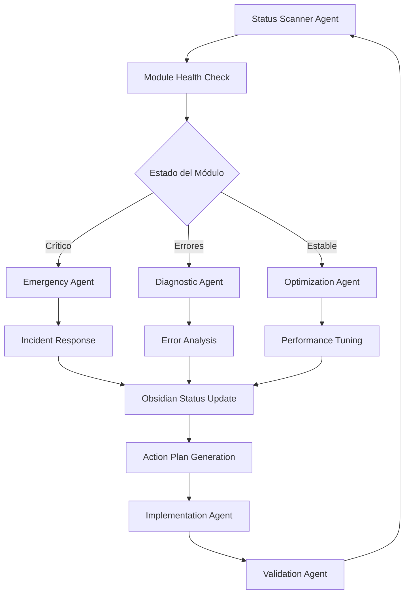

# 🤖 Agent-Based Workflow System for Padelyzer MVP

> **Objetivo**: Sistema automatizado de agentes que monitorea, diagnostica y estabiliza cada módulo hacia un MVP exitoso

## 🎯 Visión del Sistema

### Flujo Principal


## 🤖 Arquitectura de Agentes

### 1. 🔍 Status Scanner Agent
**Propósito**: Escaneo continuo del estado real de cada módulo

**Funciones**:
- Análisis de código fuente
- Verificación de tests
- Detección de errores
- Medición de performance
- Estado de dependencias

**Implementación**:
```python
# docs/agents/status_scanner.py
class StatusScannerAgent:
    def scan_module(self, module_name):
        """
        Escanea el estado real de un módulo
        """
        return {
            'module': module_name,
            'code_health': self.analyze_code_quality(),
            'test_coverage': self.check_test_coverage(),
            'errors': self.detect_errors(),
            'performance': self.measure_performance(),
            'dependencies': self.check_dependencies(),
            'last_updated': datetime.now(),
            'status': self.calculate_overall_status()
        }
```

**Output**: Status updates en Obsidian con métricas reales

### 2. 🩺 Diagnostic Agent  
**Propósito**: Diagnóstico profundo de errores y problemas

**Funciones**:
- Análisis de stack traces
- Identificación de root causes
- Mapeo de dependencias afectadas
- Estimación de impacto
- Priorización de fixes

**Especialización por Módulo**:
- **Authentication**: Sessions, JWT, permissions
- **Finance**: Payment flows, Stripe integration
- **Reservations**: Availability, booking conflicts
- **Clubs**: Multi-tenancy, data isolation

### 3. 🚨 Emergency Agent
**Propósito**: Respuesta automática a situaciones críticas

**Triggers**:
- Finance module errors (dinero en riesgo)
- Security vulnerabilities
- Database corruption
- Payment gateway failures

**Actions**:
- Automatic rollback procedures
- Emergency notifications
- System lockdown if necessary
- Incident documentation

### 4. ⚡ Optimization Agent
**Propósito**: Mejora continua de módulos estables

**Funciones**:
- Performance optimization
- Code refactoring suggestions  
- Architecture improvements
- Best practices implementation

### 5. 📋 Implementation Agent
**Propósito**: Ejecución automatizada de planes de acción

**Funciones**:
- Code generation
- Test creation
- Configuration updates
- Database migrations

### 6. ✅ Validation Agent
**Propósito**: Validación de cambios y estabilidad

**Funciones**:
- Regression testing
- Integration testing
- Performance benchmarks
- Security scans

## 📊 Estado Real del Módulo en Obsidian

### Template: Module Status Card
```markdown
# 📊 [Module Name] - Status Dashboard

## 🚦 Estado Actual
- **Status**: 🟢 Estable | 🟡 Advertencias | 🔴 Crítico
- **Progreso MVP**: 85% → 90%
- **Última Actualización**: 2025-01-11 14:30
- **Próxima Revisión**: 2025-01-12 09:00

## 📈 Métricas en Tiempo Real

### Calidad de Código
- **Test Coverage**: 87% ↗️ (+3%)
- **Code Quality**: A- (SonarQube)
- **Technical Debt**: 2.5h ↘️ (-0.5h)
- **Vulnerabilities**: 0 críticas, 1 menor

### Performance
- **API Response Time**: 145ms ↘️ (-15ms)
- **Database Queries**: Optimizadas ✅
- **Memory Usage**: 120MB ↘️ (-20MB)
- **Error Rate**: 0.2% ↘️ (-0.1%)

### Funcionalidad
- **Core Features**: 8/8 ✅
- **MVP Features**: 12/15 🔄
- **Edge Cases**: 3/5 ✅
- **Integration Tests**: 45/50 ✅

## 🚨 Errores Activos

### 🔴 Críticos (0)
*Ningún error crítico detectado*

### 🟡 Advertencias (2)
1. **Warning**: [FIN-001] Webhook timeout en 1% de casos
   - **Impacto**: Medio
   - **ETA Fix**: 2 días
   - **Assigned**: Finance Agent

2. **Warning**: [RES-003] Cache invalidation delay
   - **Impacto**: Bajo  
   - **ETA Fix**: 1 día
   - **Assigned**: Performance Agent

## 🎯 Plan de Acción MVP

### Esta Semana (Prioridad Alta)
- [ ] Fix webhook timeouts (Finance)
- [ ] Optimize cache invalidation (Reservations)
- [ ] Complete integration tests (3 pending)
- [ ] Security audit (scheduled)

### Próxima Semana (Prioridad Media)
- [ ] Performance optimization
- [ ] Code refactoring  
- [ ] Documentation updates
- [ ] Stress testing

## 📊 Tendencias (30 días)

### Mejoras ↗️
- Test coverage: 78% → 87%
- Performance: 180ms → 145ms
- Error rate: 0.5% → 0.2%

### Regresiones ↘️
- Memory usage: +5% (controlado)
- Build time: +30s (aceptable)

## 🔄 Historial de Cambios

### 2025-01-11 14:30
- ✅ Fixed payment processing race condition
- ✅ Updated Stripe webhook handlers
- 🔄 Started cache optimization

### 2025-01-10 09:15
- ✅ Implemented error retry logic
- ⚠️ Detected webhook timeout issue
- 🔄 Performance analysis initiated

## 🤖 Agente Asignado
**Primary**: Finance Module Specialist
**Support**: Performance Optimization Agent
**Emergency**: Critical Response Team
```

## 🛠️ Implementación del Sistema

### Estructura de Archivos
```
docs/
├── agents/
│   ├── status_scanner.py
│   ├── diagnostic_agent.py
│   ├── emergency_agent.py
│   ├── optimization_agent.py
│   ├── implementation_agent.py
│   └── validation_agent.py
├── workflows/
│   ├── mvp_stabilization.md
│   ├── error_response.md
│   └── optimization_pipeline.md
├── modules/
│   ├── Authentication/
│   │   ├── status.md
│   │   ├── errors.md
│   │   └── action-plan.md
│   ├── Finance/
│   │   ├── status.md
│   │   ├── errors.md
│   │   └── action-plan.md
│   └── [otros módulos]/
└── dashboards/
    ├── mvp-progress.md
    ├── error-overview.md
    └── performance-metrics.md
```

### Automatización con Scripts

#### 1. Health Check Scanner
```bash
#!/bin/bash
# scripts/health_check.sh

echo "🔍 Scanning module health..."

# Run tests
python manage.py test --verbosity=0 --parallel

# Check code quality  
flake8 backend/
black --check backend/
mypy backend/

# Performance metrics
python manage.py check --deploy

# Update Obsidian status
python docs/agents/update_status.py
```

#### 2. Error Detection
```bash
#!/bin/bash
# scripts/error_detection.sh

echo "🚨 Scanning for errors..."

# Log analysis
tail -n 1000 logs/error.log | python docs/agents/analyze_errors.py

# Database integrity
python manage.py check_db_integrity

# Payment system health
python manage.py finance_health_check

# Update error dashboard
python docs/agents/update_errors.py
```

#### 3. Status Update
```python
# docs/agents/update_status.py
import json
from datetime import datetime

class ObsidianStatusUpdater:
    def update_module_status(self, module_name, metrics):
        """
        Actualiza el estado del módulo en Obsidian
        """
        status_file = f"docs/modules/{module_name}/status.md"
        
        template = self.load_template("module_status_template.md")
        content = template.format(**metrics)
        
        with open(status_file, 'w') as f:
            f.write(content)
        
        # Update central dashboard
        self.update_mvp_dashboard(module_name, metrics)
```

## 🎯 MVP Stabilization Pipeline

### Fase 1: Diagnóstico Completo (Semana 1)
```markdown
## Objetivos Semanales

### Día 1-2: Status Scanner Implementation
- [ ] Deploy status scanner agents
- [ ] Generate baseline metrics for all modules
- [ ] Identify critical issues
- [ ] Set up Obsidian dashboards

### Día 3-4: Error Analysis
- [ ] Run comprehensive error detection
- [ ] Categorize issues by severity
- [ ] Create action plans for each module
- [ ] Assign agents to critical issues

### Día 5-7: Emergency Fixes
- [ ] Address all critical issues
- [ ] Implement emergency fixes
- [ ] Validate fixes with automated tests
- [ ] Update status dashboards
```

### Fase 2: Estabilización (Semana 2-3)
```markdown
## Módulos Priority Queue

### 🔴 Finance Module (Día 8-10)
- **Agent**: Finance Specialist + Security Agent
- **Focus**: Payment processing, Stripe webhooks, audit trails
- **Target**: 95% reliability, <100ms response time
- **Validation**: Real money test transactions

### 🔴 Authentication (Día 11-12)
- **Agent**: Security Specialist
- **Focus**: JWT security, session management, permissions
- **Target**: Zero security vulnerabilities
- **Validation**: Penetration testing

### 🟡 Reservations (Día 13-14)
- **Agent**: Booking Specialist + Performance Agent
- **Focus**: Availability algorithm, booking conflicts
- **Target**: <50ms availability checks
- **Validation**: Load testing 1000 concurrent bookings

### 🟡 Clubs (Día 15-16)
- **Agent**: Multi-tenancy Specialist
- **Focus**: Data isolation, performance optimization
- **Target**: Support 100+ clubs
- **Validation**: Multi-tenant stress testing
```

### Fase 3: Optimización Final (Semana 4)
```markdown
## Final MVP Polish

### Performance Optimization
- [ ] Database query optimization
- [ ] Frontend bundle optimization
- [ ] API response time tuning
- [ ] Memory usage optimization

### User Experience
- [ ] Mobile responsiveness
- [ ] Loading state improvements
- [ ] Error message clarity
- [ ] Accessibility compliance

### Production Readiness
- [ ] Monitoring setup
- [ ] Error tracking
- [ ] Performance monitoring
- [ ] Security scanning
```

## 📊 Success Metrics Dashboard

### MVP Readiness Criteria
```markdown
## 🎯 MVP Success Metrics

### Technical Stability ✅
- [ ] All modules >90% test coverage
- [ ] Zero critical security vulnerabilities  
- [ ] API response time <200ms average
- [ ] 99.9% uptime in staging
- [ ] Database queries optimized

### Business Functionality ✅
- [ ] Complete booking flow (Reservation + Payment)
- [ ] Multi-club support working
- [ ] User authentication secure
- [ ] Financial transactions accurate
- [ ] Admin dashboard functional

### User Experience ✅
- [ ] Mobile responsive design
- [ ] Intuitive navigation
- [ ] Clear error messages
- [ ] Fast page loads (<3s)
- [ ] Accessibility compliant

### Production Readiness ✅
- [ ] CI/CD pipeline working
- [ ] Monitoring configured
- [ ] Error tracking active
- [ ] Database backups automated
- [ ] Security scanning passed
```

## 🚀 Agent Deployment Strategy

### 1. Immediate Deployment (Día 1)
- Status Scanner Agent
- Emergency Agent (Finance focus)
- Obsidian Dashboard setup

### 2. Week 1 Rollout
- Diagnostic Agent per module
- Implementation Agent
- Validation Agent

### 3. Week 2-4 Operation
- Full agent ecosystem active
- Automated monitoring and fixes
- Continuous optimization
- MVP validation

## 🔗 Integration Points

### Con Claude Code
- Agents como sub-agents especializados
- Llamadas automáticas para fixes
- Context sharing entre agentes

### Con Obsidian
- Templates dinámicos
- Auto-update de status
- Dashboard interactivos
- Progress tracking

### Con el Codebase
- Health checks integrados
- Automated testing
- Performance monitoring
- Error tracking

---

**🎯 Objetivo Final**: MVP estable y listo para producción en 4 semanas con sistema de agentes que garantiza calidad continua.