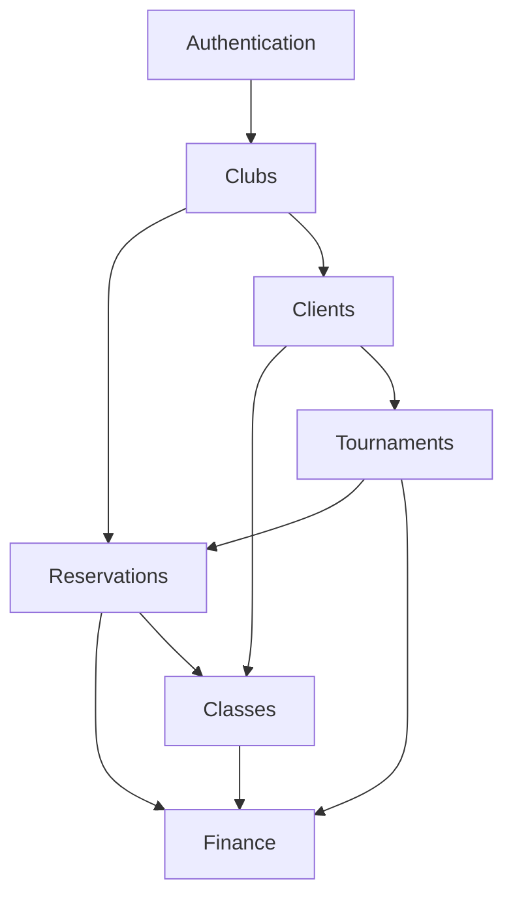

# 🏗️ Padelyzer Modules Overview

> **Central hub for all Padelyzer system modules and their interconnections**

## 📊 Module Architecture

## 🔗 Core Modules

### 🔐 [[Authentication]] System
- **Documentation**: [[Modules/Authentication/README]]
- **Status**: [[Modules/Authentication/status]]
- **Purpose**: User management, security, multi-tenancy
- **Dependencies**: None (foundational)
- **Used By**: All modules
- **Sprint Focus**: [[Sprints/Sprint-19-Quality|Sprint 19]] (Security hardening)

### 🏢 [[Clubs]] Management  
- **Documentation**: [[Modules/Clubs/README]]
- **Status**: [[Modules/Clubs/status]]
- **Purpose**: Club profiles, court management, facility operations
- **Dependencies**: [[Authentication]]
- **Used By**: [[Reservations]], [[Classes]]
- **Sprint Focus**: [[Sprints/Sprint-16-Foundation|Sprint 16]] (Analytics integration)

### 📅 [[Reservations]] Engine
- **Documentation**: [[Modules/Reservations/README]]
- **Status**: [[Modules/Reservations/status]]
- **Purpose**: Court booking, scheduling, availability management
- **Dependencies**: [[Clubs]], [[Authentication]]
- **Used By**: [[Finance]], [[Tournaments]]
- **Sprint Focus**: [[Sprints/Sprint-17-Mobile|Sprint 17]] (Mobile optimization), [[Sprints/Sprint-18-Advanced|Sprint 18]] (Dynamic pricing)

### 💰 [[Finance]] & Payments
- **Documentation**: [[Modules/Finance/README]]
- **Status**: [[Modules/Finance/status]]
- **Purpose**: Payment processing, billing, revenue management
- **Dependencies**: [[Reservations]], [[Classes]]
- **Used By**: All booking-related modules
- **Sprint Focus**: [[Sprints/Sprint-16-Foundation|Sprint 16]] (Webhook completion), [[Sprints/Sprint-18-Advanced|Sprint 18]] (Dynamic pricing)

### 👥 [[Clients]] & Profiles
- **Documentation**: [[Modules/Clients/README]]
- **Status**: [[Modules/Clients/status]]
- **Purpose**: Player profiles, social features, partner matching
- **Dependencies**: [[Authentication]], [[Clubs]]
- **Used By**: [[Classes]], [[Tournaments]]
- **Sprint Focus**: [[Sprints/Sprint-18-Advanced|Sprint 18]] (AI partner matching)

### 📚 [[Classes]] & Instruction
- **Documentation**: [[Modules/Classes/README]]
- **Status**: [[Modules/Classes/status]]
- **Purpose**: Class scheduling, instructor management, student progress
- **Dependencies**: [[Clubs]], [[Clients]]
- **Used By**: [[Finance]]
- **Sprint Focus**: [[Sprints/Sprint-16-Foundation|Sprint 16]] (API completion)

### 🏆 [[Tournaments]] & Competition
- **Documentation**: [[Modules/Tournaments/README]]
- **Status**: [[Modules/Tournaments/status]]
- **Purpose**: Tournament management, bracket generation, competitions
- **Dependencies**: [[Clients]], [[Reservations]]
- **Used By**: [[Finance]]
- **Sprint Focus**: [[Sprints/Sprint-18-Advanced|Sprint 18]] (Live streaming)

## 📈 Module Maturity Matrix

| Module | Code Complete | API Complete | Tests Complete | Prod Ready |
|--------|:-------------:|:------------:|:--------------:|:----------:|
| [[Modules/Authentication/README\|Authentication]] | ✅ | ✅ | ✅ | ✅ |
| [[Modules/Clubs/README\|Clubs]] | ✅ | ✅ | ✅ | ✅ |
| [[Modules/Reservations/README\|Reservations]] | ✅ | ✅ | ⚠️ | ✅ |
| [[Modules/Finance/README\|Finance]] | ✅ | ⚠️ | ✅ | ⚠️ |
| [[Modules/Clients/README\|Clients]] | ✅ | ✅ | ⚠️ | ✅ |
| [[Modules/Classes/README\|Classes]] | ✅ | 🔄 | ❌ | ❌ |
| [[Modules/Tournaments/README\|Tournaments]] | ⚠️ | 🔄 | ❌ | ❌ |

**Legend**: ✅ Complete | ⚠️ Partial | 🔄 In Progress | ❌ Not Started

## 🎯 Sprint Integration

### [[Sprints/Sprint-16-Foundation]]
**Focus Modules**: 
- [[Modules/Finance/README|Finance]] - Complete Stripe webhooks
- [[Modules/Classes/README|Classes]] - Complete API implementation
- **All Modules** - BI Dashboard data integration

### [[Sprints/Sprint-17-Mobile]]
**Focus Modules**:
- [[Modules/Reservations/README|Reservations]] - Mobile booking optimization
- [[Modules/Clubs/README|Clubs]] - Location-based discovery
- [[Modules/Authentication/README|Authentication]] - Mobile security

### [[Sprints/Sprint-18-Advanced]]
**Focus Modules**:
- [[Modules/Clients/README|Clients]] - AI partner matching
- [[Modules/Finance/README|Finance]] - Dynamic pricing engine
- [[Modules/Tournaments/README|Tournaments]] - Live streaming

### [[Sprints/Sprint-19-Quality]]
**Focus Modules**:
- **All Modules** - Comprehensive testing and security hardening

### [[Sprints/Sprint-20-Launch]]
**Focus Modules**:
- **All Modules** - Production deployment and monitoring

## 🔄 Data Flow Between Modules

### User Registration Flow
1. [[Modules/Authentication/README|Authentication]] - User creation
2. [[Modules/Clubs/README|Clubs]] - Club association
3. [[Modules/Clients/README|Clients]] - Profile creation

### Booking Flow
1. [[Modules/Clubs/README|Clubs]] - Court availability
2. [[Modules/Reservations/README|Reservations]] - Booking creation
3. [[Modules/Finance/README|Finance]] - Payment processing

### Class Enrollment Flow
1. [[Modules/Classes/README|Classes]] - Class availability
2. [[Modules/Clients/README|Clients]] - Student enrollment
3. [[Modules/Finance/README|Finance]] - Payment processing

### Tournament Entry Flow
1. [[Modules/Tournaments/README|Tournaments]] - Tournament registration
2. [[Modules/Clients/README|Clients]] - Player validation
3. [[Modules/Reservations/README|Reservations]] - Court scheduling
4. [[Modules/Finance/README|Finance]] - Entry fee processing

## 📊 Module Health Dashboard

### Current Status Summary
- **Production Ready**: 4/7 modules (57%)
- **MVP Ready**: 6/7 modules (86%)
- **Average Health Score**: 95/100
- **Critical Issues**: 0
- **Pending Tasks**: Webhooks, API completion, testing

### Next Actions
- **Immediate**: [[Tasks/Active-Tasks]] - Complete Finance webhooks
- **Sprint 16**: [[Sprints/Sprint-16-Foundation]] - BI integration
- **Quality Gate**: [[Sprints/Sprint-19-Quality]] - Testing completion

## 🔗 Related Documentation

### Planning & Progress
- [[Home]] - Project dashboard
- [[Sprint Dashboard]] - Current sprint status
- [[Progress/README]] - Historical progress
- [[Next Actions]] - Immediate priorities

### Development Resources
- [[Agent-Workflow-System]] - Automated monitoring
- [[Executive-Summary]] - High-level overview
- [[Tasks/README]] - Task management system

### Templates & Standards
- [[Templates/task-template]] - Task creation template
- [[Templates/sprint-retrospective]] - Sprint review template

---

**🔄 Last Updated**: Auto-updated by [[agents/status_scanner.py|Status Scanner]]
**📊 Health Score**: 95/100 - Excellent
**🎯 MVP Status**: 86% Ready