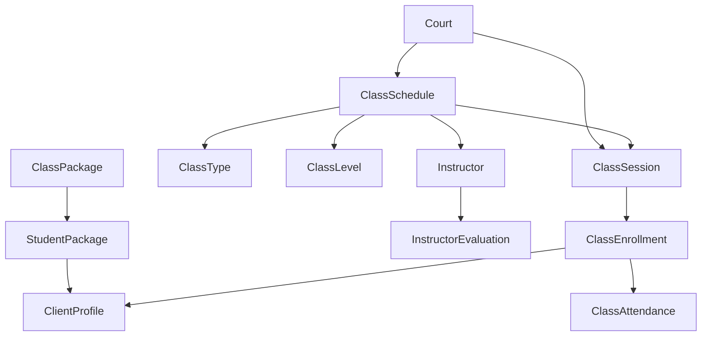

# 📚 Classes Module - Complete Documentation

> **Comprehensive class management system with instructor management, session scheduling, and student progress tracking**

## 📊 Module Overview

### Status Dashboard
- **Implementation Status**: ✅ **60% Complete** - Strong foundation with core models implemented
- **Production Readiness**: 🟡 **In Progress** - Core functionality ready, needs API completion
- **Critical Features**: 5/10 Complete
- **Business Priority**: Medium-High - Educational features for skill development

### Key Features
- **Class Management**: Complete class scheduling and management system
- **Instructor Profiles**: Professional instructor management with ratings
- **Student Enrollment**: Flexible enrollment system with waitlists
- **Session Tracking**: Individual session management and attendance
- **Package System**: Class packages for bulk purchases
- **Progress Tracking**: Student progress and instructor evaluations
- **Flexible Scheduling**: Recurring schedules with various patterns

---

## 🏗️ Architecture Overview

### Core Components


### Module Structure
```
apps/classes/
├── models.py          # ✅ Core class models (11 models)
├── views.py           # 🔄 API ViewSets (needs completion)
├── serializers.py     # 🔄 Data serialization (needs completion)
├── urls.py            # 🔄 API routing (needs completion)
├── services.py        # 📋 Business logic services
├── managers.py        # 📋 Custom model managers
├── admin.py           # ✅ Django admin interface
├── migrations/        # ✅ Database migrations
└── tests/             # 📋 Test coverage (needs implementation)
```

---

## 📋 Data Models

### 1. 🎯 ClassLevel Model
**Purpose**: Class difficulty level categorization

```python
class ClassLevel(BaseModel):
    LEVEL_CHOICES = [
        ("beginner", "Principiante"),         # New to padel
        ("intermediate", "Intermedio"),       # Some experience
        ("advanced", "Avanzado"),             # Experienced players
        ("all_levels", "Todos los Niveles"),  # Mixed skill levels
    ]
```

**Key Fields**:
- `name`: Level identifier (beginner, intermediate, etc.)
- `display_name`: Human-readable level name
- `order`: Display order for UI
- `color` / `icon`: Visual representation

### 2. 📝 ClassType Model
**Purpose**: Different types of classes offered

```python
class ClassType(MultiTenantModel):
    TYPE_CHOICES = [
        ("group", "Grupal"),                  # Group classes (4-8 people)
        ("individual", "Individual"),         # 1-on-1 training
        ("clinic", "Clínica"),                # Focused skill clinics
        ("intensive", "Intensivo"),           # Intensive training camps
        ("workshop", "Taller"),               # Special workshops
    ]
```

**Configuration Fields**:
```python
# Capacity Management
min_participants = IntegerField(default=1)        # Minimum to run class
max_participants = IntegerField(default=4)        # Maximum enrollment

# Pricing Structure
base_price = DecimalField()                       # Base class price
price_per_participant = BooleanField()            # Per-person vs. flat rate

# Class Settings
allow_drop_in = BooleanField(default=False)       # Drop-in allowed
requires_package = BooleanField(default=False)    # Package required
allow_waitlist = BooleanField(default=True)       # Waitlist enabled
```

### 3. 👨‍🏫 Instructor Model (Core)
**Purpose**: Professional instructor management and profiles

```python
class Instructor(MultiTenantModel):
    user = OneToOneField(User)                    # Link to user account
    
    # Professional Information
    bio = TextField()                             # Instructor biography
    specialties = ManyToManyField(ClassType)      # Teaching specialties
    certifications = JSONField()                  # List of certifications
    years_experience = IntegerField()             # Years teaching
    
    # Availability Settings
    available_days = JSONField()                  # Available days (0=Mon, 6=Sun)
    available_from = TimeField(default="08:00")   # Daily start time
    available_until = TimeField(default="20:00")  # Daily end time
    
    # Performance Metrics
    rating = DecimalField(max_digits=3, decimal_places=2) # Average rating (0-5)
    total_ratings = IntegerField(default=0)       # Number of ratings
    
    # Settings
    accepts_substitutions = BooleanField(default=True) # Available as substitute
    max_weekly_hours = IntegerField(default=40)    # Maximum weekly teaching hours
```

**Rating System**:
```python
def update_rating(self, new_rating):
    """Update instructor rating with rolling average"""
    total = self.rating * self.total_ratings + new_rating
    self.total_ratings += 1
    self.rating = total / self.total_ratings
    self.save()
```

### 4. 📅 ClassSchedule Model (Core)
**Purpose**: Recurring class schedule management

```python
class ClassSchedule(MultiTenantModel):
    # Basic Configuration
    name = CharField(max_length=200)              # Schedule name
    class_type = ForeignKey(ClassType)            # Type of class
    level = ForeignKey(ClassLevel)               # Skill level
    instructor = ForeignKey(Instructor)          # Primary instructor
    
    # Location
    court = ForeignKey(Court, null=True)          # Court assignment
    location = CharField()                        # Alternative location
    
    # Timing Configuration
    start_date = DateField()                      # Schedule start
    end_date = DateField(null=True)               # Schedule end (optional)
    start_time = TimeField()                      # Class start time
    duration_minutes = IntegerField()             # Class duration
    
    # Recurrence Patterns
    RECURRENCE_CHOICES = [
        ("once", "Una vez"),                      # Single class
        ("daily", "Diario"),                      # Daily classes
        ("weekly", "Semanal"),                    # Weekly classes
        ("biweekly", "Quincenal"),                # Every two weeks
        ("monthly", "Mensual"),                   # Monthly classes
    ]
    recurrence = CharField(choices=RECURRENCE_CHOICES)
    recurrence_days = JSONField()                 # Days for weekly/biweekly
    
    # Capacity & Pricing
    min_participants = IntegerField()             # Minimum to run
    max_participants = IntegerField()             # Maximum enrollment
    price = DecimalField()                        # Regular price
    member_price = DecimalField(null=True)        # Member discount price
    
    # Enrollment Settings
    enrollment_opens_days = IntegerField(default=30)    # Days before enrollment opens
    enrollment_closes_hours = IntegerField(default=2)   # Hours before enrollment closes
```

**Session Generation**:
```python
def generate_sessions(self, until_date=None):
    """Generate individual class sessions based on schedule"""
    # Algorithm creates ClassSession instances based on recurrence pattern
    # Handles weekly, daily, monthly, and one-time patterns
    # Returns count of sessions created
```

### 5. 🗓️ ClassSession Model (Core)
**Purpose**: Individual class session instances

```python
class ClassSession(MultiTenantModel):
    schedule = ForeignKey(ClassSchedule)          # Parent schedule
    
    # Session Details
    scheduled_datetime = DateTimeField()         # When class occurs
    actual_start_time = DateTimeField(null=True) # Actual start time
    actual_end_time = DateTimeField(null=True)   # Actual end time
    duration_minutes = IntegerField()            # Planned duration
    
    # Staffing
    instructor = ForeignKey(Instructor)          # Primary instructor
    substitute_instructor = ForeignKey(Instructor, null=True) # Substitute if needed
    
    # Capacity Tracking
    max_participants = IntegerField()            # Maximum enrollment
    enrolled_count = IntegerField(default=0)     # Current enrollment
    attended_count = IntegerField(default=0)     # Actual attendance
    
    # Status Management
    STATUS_CHOICES = [
        ("scheduled", "Programada"),             # Ready for enrollment
        ("confirmed", "Confirmada"),             # Minimum enrollment met
        ("in_progress", "En Progreso"),          # Class in session
        ("completed", "Completada"),             # Class finished
        ("cancelled", "Cancelada"),              # Class cancelled
    ]
    status = CharField(choices=STATUS_CHOICES)
```

**Enrollment Logic**:
```python
def can_enroll(self, user):
    """Comprehensive enrollment validation"""
    # Check if class is cancelled
    # Check if class has started
    # Check enrollment deadline
    # Check if user already enrolled
    # Check if class is full
    # Return (can_enroll: bool, message: str)
```

### 6. 📝 ClassEnrollment Model
**Purpose**: Student enrollment management

```python
class ClassEnrollment(BaseModel):
    session = ForeignKey(ClassSession)           # Class session
    student = ForeignKey(ClientProfile)          # Enrolled student
    
    # Enrollment Status
    STATUS_CHOICES = [
        ("enrolled", "Inscrito"),                # Active enrollment
        ("waitlisted", "Lista de Espera"),       # On waiting list
        ("cancelled", "Cancelado"),              # Cancelled enrollment
        ("no_show", "No Asistió"),               # Didn't attend
    ]
    status = CharField(choices=STATUS_CHOICES)
    waitlist_position = IntegerField(null=True)  # Position on waitlist
    
    # Payment Integration
    paid = BooleanField(default=False)           # Payment status
    payment_amount = DecimalField(null=True)     # Amount paid
    payment_method = CharField()                 # Payment method used
    payment_reference = CharField()              # Payment reference
    
    # Check-in System
    checked_in = BooleanField(default=False)     # Student checked in
    check_in_time = DateTimeField(null=True)     # Check-in timestamp
```

**Cancellation Logic**:
```python
def cancel(self, reason=""):
    """Cancel enrollment and manage waitlist"""
    self.status = "cancelled"
    self.cancelled_at = timezone.now()
    
    # Update session enrollment count
    self.session.enrolled_count -= 1
    
    # Promote next waitlisted student
    next_student = get_next_waitlisted()
    if next_student:
        next_student.promote_from_waitlist()
```

### 7. ✅ ClassAttendance Model
**Purpose**: Detailed attendance tracking and performance evaluation

```python
class ClassAttendance(BaseModel):
    session = ForeignKey(ClassSession)           # Class session
    enrollment = OneToOneField(ClassEnrollment)  # Related enrollment
    student = ForeignKey(ClientProfile)          # Student attended
    
    # Attendance Tracking
    present = BooleanField(default=False)        # Actually attended
    arrival_time = DateTimeField(null=True)      # Arrival time
    departure_time = DateTimeField(null=True)    # Departure time
    
    # Instructor Assessment
    instructor_notes = TextField()               # Instructor feedback
    performance_rating = IntegerField(null=True) # Performance (1-5)
    
    # Student Feedback
    student_rating = IntegerField(null=True)     # Class rating (1-5)
    student_feedback = TextField()               # Student comments
```

### 8. ⭐ InstructorEvaluation Model
**Purpose**: Student evaluation of instructors

```python
class InstructorEvaluation(BaseModel):
    instructor = ForeignKey(Instructor)          # Evaluated instructor
    student = ForeignKey(ClientProfile)          # Evaluating student
    session = ForeignKey(ClassSession)           # Specific session
    
    # Detailed Ratings (1-5 scale)
    overall_rating = IntegerField()              # Overall satisfaction
    teaching_quality = IntegerField()            # Teaching effectiveness
    punctuality = IntegerField()                 # On-time performance
    communication = IntegerField()               # Communication skills
    
    # Feedback
    comments = TextField()                       # Written feedback
    would_recommend = BooleanField(default=True) # Recommendation
    is_anonymous = BooleanField(default=False)   # Anonymous evaluation
```

**Auto-Update Rating**:
```python
def save(self, *args, **kwargs):
    super().save(*args, **kwargs)
    # Automatically update instructor's overall rating
    self.instructor.update_rating(self.overall_rating)
```

### 9. 📦 ClassPackage Model
**Purpose**: Bulk class purchase system

```python
class ClassPackage(MultiTenantModel):
    name = CharField(max_length=100)             # Package name
    description = TextField()                    # Package description
    
    # Package Configuration
    class_types = ManyToManyField(ClassType)     # Included class types
    num_classes = IntegerField()                 # Number of classes
    validity_days = IntegerField()               # Days valid after purchase
    
    # Pricing
    price = DecimalField()                       # Package price
    
    # Settings
    transferable = BooleanField(default=False)   # Can transfer to others
```

### 10. 🎫 StudentPackage Model
**Purpose**: Student's purchased class packages

```python
class StudentPackage(BaseModel):
    student = ForeignKey(ClientProfile)          # Package owner
    package = ForeignKey(ClassPackage)           # Package type
    
    # Purchase Information
    purchased_at = DateTimeField()               # Purchase date
    expires_at = DateTimeField()                 # Expiration date
    
    # Usage Tracking
    classes_remaining = IntegerField()           # Classes left
    classes_used = IntegerField(default=0)       # Classes consumed
    
    # Payment Details
    payment_amount = DecimalField()              # Amount paid
    payment_reference = CharField()              # Payment reference
```

**Usage Methods**:
```python
def use_class(self):
    """Use one class from package"""
    if self.classes_remaining > 0:
        self.classes_remaining -= 1
        self.classes_used += 1
        self.save()
        return True
    return False
```

---

## 🔗 API Endpoints (Planned Implementation)

### Class Management API
```http
# Class Schedules
GET /api/classes/schedules/                   # List class schedules
POST /api/classes/schedules/                  # Create schedule
GET /api/classes/schedules/{id}/              # Schedule details
PUT/PATCH /api/classes/schedules/{id}/        # Update schedule
DELETE /api/classes/schedules/{id}/           # Delete schedule

# Schedule Actions
POST /api/classes/schedules/{id}/generate_sessions/ # Generate sessions
POST /api/classes/schedules/{id}/publish/     # Publish schedule
POST /api/classes/schedules/{id}/cancel/      # Cancel schedule

# Class Sessions
GET /api/classes/sessions/                    # List sessions
GET /api/classes/sessions/{id}/               # Session details
PUT/PATCH /api/classes/sessions/{id}/         # Update session

# Session Actions
POST /api/classes/sessions/{id}/enroll/       # Enroll in session
POST /api/classes/sessions/{id}/cancel_enrollment/ # Cancel enrollment
POST /api/classes/sessions/{id}/check_in/     # Check in student
POST /api/classes/sessions/{id}/mark_attendance/ # Mark attendance
```

### Instructor Management API
```http
# Instructor Profiles
GET /api/classes/instructors/                 # List instructors
POST /api/classes/instructors/                # Create instructor
GET /api/classes/instructors/{id}/            # Instructor details
PUT/PATCH /api/classes/instructors/{id}/      # Update instructor

# Instructor Actions
GET /api/classes/instructors/{id}/schedule/   # Instructor schedule
GET /api/classes/instructors/{id}/evaluations/ # Get evaluations
POST /api/classes/instructors/{id}/evaluate/  # Submit evaluation
GET /api/classes/instructors/{id}/availability/ # Check availability
```

### Student Enrollment API
```http
# Student Classes
GET /api/classes/my_classes/                  # Student's enrolled classes
GET /api/classes/my_packages/                 # Student's packages
POST /api/classes/enroll/                     # Enroll in class
DELETE /api/classes/enrollments/{id}/         # Cancel enrollment

# Class Packages
GET /api/classes/packages/                    # Available packages
POST /api/classes/packages/{id}/purchase/     # Purchase package
GET /api/classes/packages/my_packages/        # My purchased packages
```

### Class Discovery API
```http
# Class Search and Filtering
GET /api/classes/sessions/available/          # Available sessions
GET /api/classes/sessions/by_date/            # Sessions by date
GET /api/classes/sessions/by_instructor/      # Sessions by instructor
GET /api/classes/sessions/by_level/           # Sessions by skill level

# Advanced Search
POST /api/classes/search/                     # Advanced class search
GET /api/classes/recommendations/             # Personalized recommendations
```

---

## 🎯 Business Logic & Features

### Intelligent Scheduling System
```python
class SchedulingEngine:
    def generate_optimal_schedule(self, instructor, preferences):
        """Generate optimized class schedule"""
        # Consider instructor availability
        # Balance class distribution
        # Avoid conflicts with existing bookings
        # Optimize court usage
        # Account for student preferences
        
    def handle_instructor_conflict(self, session, conflict_type):
        """Handle scheduling conflicts"""
        if conflict_type == "unavailable":
            return self.find_substitute_instructor(session)
        elif conflict_type == "overbooked":
            return self.reschedule_session(session)
```

### Enrollment Management System
```python
class EnrollmentManager:
    def process_enrollment(self, student, session):
        """Process student enrollment with business rules"""
        # Check eligibility
        can_enroll, message = session.can_enroll(student.user)
        if not can_enroll:
            return False, message
            
        # Check capacity
        if session.is_full:
            if session.schedule.allow_waitlist:
                return self.add_to_waitlist(student, session)
            else:
                return False, "Class is full"
        
        # Process enrollment
        enrollment = ClassEnrollment.objects.create(
            session=session,
            student=student,
            status="enrolled"
        )
        
        # Handle payment if required
        if session.schedule.price > 0:
            payment = self.process_payment(enrollment)
            
        return True, "Enrollment successful"
    
    def manage_waitlist(self, session):
        """Intelligent waitlist management"""
        # Notify when spots open
        # Auto-enroll from waitlist
        # Manage waitlist priorities
```

### Progress Tracking System
```python
class ProgressTracker:
    def calculate_student_progress(self, student):
        """Calculate comprehensive student progress"""
        attendances = ClassAttendance.objects.filter(
            student=student,
            present=True
        ).select_related('session__schedule__level')
        
        progress = {
            'total_classes': attendances.count(),
            'skill_development': self.analyze_skill_progression(attendances),
            'instructor_feedback': self.aggregate_instructor_notes(attendances),
            'performance_trend': self.calculate_performance_trend(attendances),
            'recommended_next_level': self.recommend_level_progression(student)
        }
        
        return progress
    
    def generate_progress_report(self, student, period):
        """Generate detailed progress report"""
        # Attendance analysis
        # Skill development tracking
        # Instructor feedback summary
        # Performance improvements
        # Recommended next steps
```

### Package Management System
```python
class PackageManager:
    def optimize_package_usage(self, student_package):
        """Optimize how student uses their package"""
        # Recommend classes that maximize learning
        # Balance different skill areas
        # Consider package expiration
        # Suggest complementary classes
        
    def handle_package_expiration(self, expired_packages):
        """Handle expired packages gracefully"""
        # Notify students before expiration
        # Offer extension options
        # Handle partial refunds
        # Convert to credits
```

---

## 🔒 Security & Permissions

### Class Management Permissions
```python
class ClassPermissions:
    def can_create_schedule(self, user, club):
        """Check schedule creation permissions"""
        return (user.is_staff or
                user.is_club_admin(club) or
                hasattr(user, 'instructor_profile'))
    
    def can_manage_enrollments(self, user, session):
        """Check enrollment management permissions"""
        return (user.is_staff or
                user.is_club_admin(session.schedule.club) or
                user == session.instructor.user)
    
    def can_view_student_progress(self, user, student):
        """Check progress viewing permissions"""
        # Students can view own progress
        if hasattr(user, 'client_profile') and user.client_profile == student:
            return True
        
        # Instructors can view their students' progress
        if hasattr(user, 'instructor_profile'):
            student_sessions = ClassAttendance.objects.filter(
                student=student,
                session__instructor__user=user
            )
            return student_sessions.exists()
        
        # Staff can view all progress
        return user.is_staff
```

### Data Privacy & Multi-tenancy
```python
# All class models inherit multi-tenancy
class ClassSchedule(MultiTenantModel):
    # Automatic organization/club filtering
    pass

# Privacy protection for student data
class ClassAttendance(BaseModel):
    def get_instructor_notes(self, requesting_user):
        """Return instructor notes based on permissions"""
        if (requesting_user.is_staff or
            requesting_user == self.session.instructor.user):
            return self.instructor_notes
        return "[Access Denied]"
```

---

## 🎨 Frontend Integration

### Class Management Components
```typescript
// Core Class Components
<ClassScheduleCard schedule={schedule} showManagement={canManage} />
<ClassSessionList sessions={sessions} viewType="instructor|student|admin" />
<EnrollmentForm session={session} onEnroll={handleEnrollment} />
<InstructorProfile instructor={instructor} showEvaluations={true} />

// Student Interface
<MyClassesDashboard enrollments={myEnrollments} />
<ClassSearch filters={searchFilters} onBook={bookClass} />
<PackagePurchase packages={availablePackages} />
<ProgressDashboard progress={studentProgress} />

// Instructor Interface
<InstructorSchedule sessions={mySessions} />
<AttendanceMarking session={currentSession} />
<StudentProgressView students={myStudents} />
<EvaluationSummary evaluations={myEvaluations} />

// Admin Components
<ScheduleManager schedules={allSchedules} />
<InstructorManagement instructors={clubInstructors} />
<ClassAnalytics metrics={classMetrics} />
```

### State Management
```typescript
interface ClassesStore {
  // Schedule Management
  schedules: ClassSchedule[]
  currentSchedule: ClassSchedule | null
  createSchedule: (data: ScheduleData) => Promise<ClassSchedule>
  updateSchedule: (id: string, data: Partial<ClassSchedule>) => Promise<void>
  
  // Session Management
  sessions: ClassSession[]
  enrollInSession: (sessionId: string) => Promise<void>
  cancelEnrollment: (enrollmentId: string) => Promise<void>
  
  // Instructor Management
  instructors: Instructor[]
  myInstructorProfile: Instructor | null
  updateInstructorProfile: (data: InstructorData) => Promise<void>
  
  // Package Management
  availablePackages: ClassPackage[]
  myPackages: StudentPackage[]
  purchasePackage: (packageId: string) => Promise<void>
  
  // Progress Tracking
  studentProgress: ProgressData | null
  fetchStudentProgress: (studentId: string) => Promise<void>
}
```

---

## 📊 Performance Optimizations

### Database Optimizations
```python
# Optimized querysets for class operations
def get_class_schedule_with_details(schedule_id):
    return ClassSchedule.objects.select_related(
        'class_type', 'level', 'instructor__user', 'court', 'club'
    ).prefetch_related(
        'sessions__enrollments__student__user',
        'sessions__attendance_records',
        'instructor__evaluations'
    ).get(id=schedule_id)

# Indexes for performance
class Meta:
    indexes = [
        models.Index(fields=['organization', 'start_date', 'is_active']),
        models.Index(fields=['instructor', 'start_date']),
        models.Index(fields=['court', 'start_date', 'start_time']),
        models.Index(fields=['scheduled_datetime', 'status']),
        models.Index(fields=['session', 'status']),  # For enrollments
    ]
```

### Caching Strategy
- **Class Schedules**: Cache published schedules for 1 hour
- **Instructor Profiles**: Cache instructor details for 30 minutes
- **Available Sessions**: Cache available sessions for 15 minutes
- **Student Progress**: Cache progress reports for 24 hours
- **Package Information**: Cache package details for 4 hours

### Background Processing
```python
# Celery tasks for class operations
@celery_app.task
def generate_class_sessions(schedule_id, until_date):
    """Generate class sessions in background"""
    schedule = ClassSchedule.objects.get(id=schedule_id)
    sessions_created = schedule.generate_sessions(until_date)
    
    # Send notifications to interested students
    notify_new_sessions.delay(schedule_id, sessions_created)

@celery_app.task
def process_class_reminders():
    """Send class reminders to enrolled students"""
    tomorrow_sessions = ClassSession.objects.filter(
        scheduled_datetime__date=timezone.now().date() + timedelta(days=1),
        status__in=['scheduled', 'confirmed']
    )
    
    for session in tomorrow_sessions:
        send_class_reminder_notifications.delay(session.id)
```

---

## 🧪 Testing Strategy

### Test Coverage Areas
```python
# Model Tests
class ClassModelTests(TestCase):
    def test_schedule_session_generation()      # Session generation logic
    def test_enrollment_capacity_management()   # Enrollment limits
    def test_waitlist_promotion()               # Waitlist management
    def test_package_usage_tracking()           # Package consumption
    
class InstructorModelTests(TestCase):
    def test_rating_calculation()               # Rating updates
    def test_availability_checking()            # Availability logic
    def test_evaluation_processing()            # Evaluation aggregation
    
class AttendanceModelTests(TestCase):
    def test_attendance_marking()               # Attendance tracking
    def test_progress_calculation()             # Progress analytics
    def test_no_show_handling()                 # No-show management

# API Tests (When Implemented)
class ClassAPITests(APITestCase):
    def test_class_crud_operations()            # Full CRUD testing
    def test_enrollment_workflow()              # Enrollment process
    def test_instructor_management()            # Instructor operations
    def test_permission_enforcement()           # Security testing
    
# Integration Tests
class ClassIntegrationTests(TransactionTestCase):
    def test_complete_class_lifecycle()         # Full class workflow
    def test_multi_session_enrollment()         # Complex enrollment scenarios
    def test_payment_integration()              # Payment processing
```

### Critical Test Scenarios
1. **Class Lifecycle**: Complete class from creation to completion
2. **Enrollment Management**: Capacity, waitlists, and payment handling
3. **Instructor Management**: Availability, substitutions, and evaluations
4. **Package System**: Purchase, usage, and expiration handling
5. **Progress Tracking**: Attendance recording and progress calculation
6. **Multi-tenancy**: Data isolation between organizations

---

## 🚀 Integration Points

### With Other Modules

#### Clients Module Integration
```python
# Student enrollment and progress tracking
class ClassEnrollment(BaseModel):
    student = ForeignKey(ClientProfile)
    
    def enroll_student(self, client_profile):
        # Check client skill level compatibility
        # Update client's class history
        # Track skill development
```

#### Clubs Module Integration
```python
# Court reservation for classes
class ClassSession(MultiTenantModel):
    court = ForeignKey(Court, null=True)
    
    def reserve_court(self):
        """Create automatic court reservation for class"""
        from apps.reservations.models import Reservation
        
        if self.court and self.scheduled_datetime:
            reservation = Reservation.objects.create(
                court=self.court,
                date=self.scheduled_datetime.date(),
                start_time=self.scheduled_datetime.time(),
                duration=self.duration_minutes,
                status='confirmed',
                booking_type='class',
                class_session=self
            )
```

#### Finance Module Integration
```python
# Class payments and package purchases
class Payment(BaseModel):
    class_enrollment = ForeignKey(ClassEnrollment, null=True)
    class_package = ForeignKey(StudentPackage, null=True)
    
def process_class_payment(enrollment):
    """Process payment for class enrollment"""
    session = enrollment.session
    amount = session.schedule.price
    
    # Apply member discount if applicable
    if enrollment.student.is_club_member:
        amount = session.schedule.member_price or amount
    
    payment = Payment.objects.create(
        amount=amount,
        payment_type='class',
        client=enrollment.student,
        class_enrollment=enrollment
    )
    return payment.process()
```

#### Authentication Module Integration
```python
# Instructor user accounts and permissions
class Instructor(MultiTenantModel):
    user = OneToOneField(User)
    
    @receiver(post_save, sender=User)
    def create_instructor_profile(sender, instance, created, **kwargs):
        if created and instance.role == 'INSTRUCTOR':
            Instructor.objects.create(
                user=instance,
                organization=instance.current_organization,
                club=instance.current_club
            )
```

---

## 🔧 Configuration & Setup

### Classes Module Settings
```python
# Django settings for classes module
CLASSES_CONFIG = {
    'AUTO_GENERATE_SESSIONS': True,             # Auto-generate sessions for schedules
    'SESSION_GENERATION_DAYS': 90,              # Days ahead to generate sessions
    'ALLOW_LAST_MINUTE_BOOKING': True,          # Allow booking close to class time
    'MINIMUM_BOOKING_HOURS': 2,                 # Minimum hours before class for booking
    'ENABLE_WAITLIST': True,                    # Enable waitlist functionality
    'MAX_WAITLIST_SIZE': 10,                    # Maximum waitlist size
    'ENABLE_PACKAGES': True,                    # Enable class packages
    'PACKAGE_EXPIRY_REMINDER_DAYS': 7,          # Days before package expiry to remind
    'INSTRUCTOR_RATING_REQUIRED': False,        # Require student ratings
}

# Notification settings
CLASS_NOTIFICATIONS = {
    'REMINDER_HOURS': [24, 2],                  # Hours before class to send reminders
    'CANCELLATION_NOTIFICATION': True,          # Notify on class cancellation
    'WAITLIST_PROMOTION': True,                 # Notify on waitlist promotion
    'PACKAGE_EXPIRY_WARNING': True,             # Warn about package expiry
}
```

### Required Dependencies
```python
# Additional requirements for classes
REQUIRED_PACKAGES = [
    'celery>=5.0.0',                # Background task processing
    'celery-beat>=2.0.0',           # Scheduled task management
    'redis>=3.5.0',                 # Task queue and caching
]

# Classes-specific permissions
CLASS_PERMISSIONS = [
    'classes.add_classschedule',
    'classes.change_classschedule',
    'classes.delete_classschedule',
    'classes.add_instructor',
    'classes.change_instructor',
    'classes.view_student_progress',
    'classes.manage_enrollments',
]
```

---

## 🐛 Known Issues & Limitations

### Current Limitations
1. **API Implementation**: Models complete but API endpoints need implementation
2. **Real-time Updates**: Basic implementation (needs WebSocket integration)
3. **Advanced Scheduling**: Simple recurrence patterns (needs complex scheduling)
4. **Progress Analytics**: Basic tracking (needs advanced analytics)
5. **Integration Testing**: Limited integration with other modules

### Planned Improvements
1. **Complete API**: Full REST API implementation with all endpoints
2. **Real-time Features**: Live class updates, instant notifications
3. **Advanced Analytics**: Detailed progress tracking, performance insights
4. **Mobile Optimization**: Native mobile class booking and attendance
5. **AI Features**: Smart scheduling, personalized recommendations

---

## 📈 Metrics & Analytics

### Class Performance KPIs
```python
# Business Metrics
def calculate_class_metrics():
    return {
        'total_classes': ClassSession.objects.count(),
        'average_enrollment': ClassSession.objects.aggregate(
            avg_enrollment=Avg('enrolled_count')
        )['avg_enrollment'],
        'class_completion_rate': calculate_completion_rate(),
        'instructor_utilization': calculate_instructor_utilization(),
        'revenue_per_class': calculate_revenue_per_class(),
        'student_retention_rate': calculate_student_retention()
    }

# Student Engagement Metrics
def calculate_engagement_metrics():
    return {
        'average_attendance_rate': calculate_attendance_rate(),
        'repeat_enrollment_rate': calculate_repeat_enrollment(),
        'package_usage_rate': calculate_package_utilization(),
        'instructor_satisfaction': calculate_instructor_ratings(),
        'class_satisfaction': calculate_class_ratings()
    }
```

---

## 🎯 Roadmap & Future Enhancements

### Phase 1: API Completion (Current Priority)
- [ ] Complete REST API implementation
- [ ] Frontend component development
- [ ] Basic testing coverage
- [ ] Integration with other modules
- [ ] Performance optimization

### Phase 2: Advanced Features
- [ ] Real-time class updates
- [ ] Advanced progress analytics
- [ ] Smart scheduling algorithms
- [ ] Mobile app optimization
- [ ] Instructor development tools

### Phase 3: Intelligence & Automation
- [ ] AI-powered class recommendations
- [ ] Predictive enrollment analytics
- [ ] Automated scheduling optimization
- [ ] Personalized learning paths
- [ ] Advanced reporting and insights

---

## 👥 Team & Ownership

**Module Owner**: Classes Module Specialist Agent  
**Primary Developer**: Backend Team Lead  
**Frontend Integration**: Frontend Team  
**Quality Assurance**: QA Team + Automated Testing  

**Key Stakeholders**:
- Club Owners (class revenue, instructor management)
- Instructors (schedule management, student progress)
- Students (class booking, progress tracking)
- Club Managers (operations, analytics)

---

**📝 Documentation Status**: Complete  
**🔄 Last Updated**: January 11, 2025  
**📊 Module Health**: 60% - Strong foundation, needs API completion  
**🎯 Next Milestone**: Complete API implementation and frontend integration for MVP

*This documentation serves as the complete reference for the Classes module, covering all aspects from technical implementation to business requirements and future roadmap.*