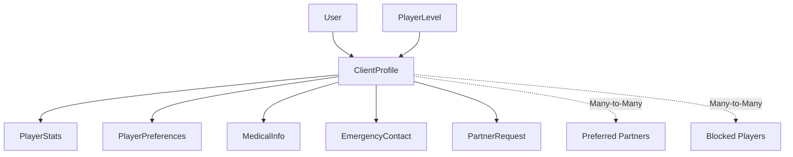

# 👥 Clients Module - Complete Documentation

> **Comprehensive player and client management system with social features and partner matching**

## 📊 Module Overview

### Status Dashboard
- **Implementation Status**: ✅ **85% Complete** - Core functionality implemented
- **Production Readiness**: 🟡 **Nearly Ready** - Needs testing and optimization
- **Critical Features**: 8/10 Complete
- **Business Priority**: High - Core user management system

### Key Features
- **Player Profiles**: Comprehensive player information management
- **Skill System**: Dynamic rating and level management
- **Partner Matching**: Advanced partner recommendation system
- **Social Features**: Friend connections and partner requests
- **Statistics Tracking**: Detailed performance metrics
- **Medical Information**: Safety and emergency contact management
- **Preferences**: Customizable player preferences and availability

---

## 🏗️ Architecture Overview

### Core Components


### Module Structure
```
apps/clients/
├── models.py          # ✅ Core data models (7 models)
├── views.py           # ✅ API ViewSets (6 ViewSets)
├── serializers.py     # ✅ Data serialization
├── urls.py            # ✅ API routing
├── managers.py        # ✅ Custom model managers
├── validators.py      # ✅ Data validation
├── mixins.py          # ✅ Multi-tenant support
├── admin.py           # ✅ Django admin interface
├── migrations/        # ✅ Database migrations
└── tests/             # 🔄 Test coverage (needs expansion)
```

---

## 📋 Data Models

### 1. 🎯 PlayerLevel Model
**Purpose**: Skill level categorization system

```python
class PlayerLevel(BaseModel):
    LEVEL_CHOICES = [
        ("beginner", "Principiante"),      # 0-250 rating
        ("intermediate", "Intermedio"),    # 251-500 rating
        ("advanced", "Avanzado"),          # 501-750 rating
        ("professional", "Profesional"),   # 751-1000 rating
    ]
```

**Key Fields**:
- `name`: Level identifier (beginner, intermediate, etc.)
- `display_name`: Human-readable name
- `min_rating` / `max_rating`: Rating range (0-1000)
- `color`: UI color code for level display
- `icon`: Visual icon for level representation

### 2. 👤 ClientProfile Model (Core)
**Purpose**: Extended player profile with comprehensive information

**Essential Fields**:
```python
# Player Information
user = OneToOneField(User)                    # Link to auth user
level = ForeignKey(PlayerLevel)               # Current skill level
rating = IntegerField(0-1000)                 # Player rating
dominant_hand = CharField(right/left/both)     # Playing preference
preferred_position = CharField(right/left/both) # Court position

# Personal Information
birth_date = DateField()                      # Age calculation
dni = CharField()                             # National ID
occupation = CharField()                      # Professional info
height/weight = IntegerField()                # Physical stats

# Social Settings
is_public = BooleanField()                    # Profile visibility
show_in_rankings = BooleanField()             # Ranking participation
allow_partner_requests = BooleanField()       # Social features
```

**Business Logic**:
- **Auto Level Assignment**: Updates level based on rating changes
- **Multi-tenancy**: Inherits organization/club from MultiTenantModel
- **Privacy Controls**: Configurable visibility settings

### 3. 📊 PlayerStats Model
**Purpose**: Comprehensive performance tracking

```python
# Match Statistics
matches_played/won/lost = IntegerField()
win_rate = DecimalField()                     # Calculated percentage
current_win_streak = IntegerField()
best_win_streak = IntegerField()

# Detailed Game Stats
sets_won/lost = IntegerField()
games_won/lost = IntegerField()
matches_as_right/left = IntegerField()        # Position tracking
wins_as_right/left = IntegerField()

# Tournament Performance
tournaments_played/won = IntegerField()
tournament_finals/semifinals = IntegerField()

# Time Tracking
total_play_time = IntegerField()              # Minutes
average_match_duration = IntegerField()
last_match_date = DateTimeField()
```

**Key Methods**:
- `record_match(won, position, duration)`: Updates all relevant stats
- `update_win_rate()`: Recalculates win percentage

### 4. ⚕️ MedicalInfo Model
**Purpose**: Health and safety information for sports activities

```python
# Basic Medical
blood_type = CharField(A+/A-/B+/B-/AB+/AB-/O+/O-)
allergies = TextField()
chronic_conditions = TextField()
current_medications = TextField()

# Sports-Related
injuries = TextField()                        # Current/past injuries
physical_limitations = TextField()
special_considerations = TextField()

# Emergency Medical
emergency_consent = BooleanField()            # Treatment consent
doctor_name/phone = CharField()
clinic_hospital = CharField()

# Insurance
insurance_company = CharField()
insurance_policy_number = CharField()
```

### 5. 📞 EmergencyContact Model
**Purpose**: Emergency contact management

```python
RELATIONSHIP_CHOICES = [
    ("spouse", "Cónyuge"),
    ("parent", "Padre/Madre"), 
    ("sibling", "Hermano/a"),
    ("child", "Hijo/a"),
    ("friend", "Amigo/a"),
    ("other", "Otro"),
]

player = ForeignKey(ClientProfile)
name = CharField()
relationship = CharField(choices=RELATIONSHIP_CHOICES)
phone/phone_alt = CharField()
email = EmailField()
is_primary = BooleanField()                   # Primary contact flag
```

### 6. ⚙️ PlayerPreferences Model
**Purpose**: Player availability and preferences

**Availability Tracking**:
```python
# Time Availability (by day type and time)
available_weekday_morning/afternoon/evening = BooleanField()
available_weekend_morning/afternoon/evening = BooleanField()

# Play Preferences
preferred_court_type = CharField(indoor/outdoor/both)
preferred_match_duration = IntegerField()     # Minutes
preferred_match_format = CharField(competitive/friendly/training)
```

**Social Preferences**:
```python
# Partner Filtering
min_partner_level = ForeignKey(PlayerLevel)
max_partner_level = ForeignKey(PlayerLevel)
preferred_partners = ManyToManyField(ClientProfile)
blocked_players = ManyToManyField(ClientProfile)

# Notifications
notify_match_invites/tournament_updates/etc = BooleanField()
email_notifications/sms_notifications/push_notifications = BooleanField()
```

**Key Methods**:
- `is_available_at(datetime)`: Checks availability for specific time

### 7. 🤝 PartnerRequest Model
**Purpose**: Partner request and social interaction system

```python
STATUS_CHOICES = [
    ("pending", "Pendiente"),
    ("accepted", "Aceptada"),
    ("rejected", "Rechazada"),
    ("cancelled", "Cancelada"),
]

from_player = ForeignKey(ClientProfile)
to_player = ForeignKey(ClientProfile)
status = CharField(choices=STATUS_CHOICES)
message = TextField()                         # Request message
match_date = DateTimeField()                  # For specific matches
responded_at = DateTimeField()
response_message = TextField()
```

**Workflow Methods**:
- `accept(message)`: Accept request with optional message
- `reject(message)`: Reject request with reason
- `cancel()`: Cancel pending request (by sender)

---

## 🔗 API Endpoints

### PlayerLevel API (Read-Only)
```http
GET /api/clients/levels/                      # List all levels
GET /api/clients/levels/{id}/                 # Level details
```

### ClientProfile API (Full CRUD)
```http
# Standard CRUD
GET /api/clients/profiles/                    # List profiles
POST /api/clients/profiles/                   # Create profile
GET /api/clients/profiles/{id}/               # Profile details
PUT/PATCH /api/clients/profiles/{id}/         # Update profile
DELETE /api/clients/profiles/{id}/            # Delete profile

# Custom Actions
GET /api/clients/profiles/me/                 # Current user's profile
POST /api/clients/profiles/search/            # Advanced search
GET /api/clients/profiles/rankings/           # Player rankings
GET /api/clients/profiles/recommendations/    # Partner recommendations

# Profile-Specific Actions
GET /api/clients/profiles/{id}/recent_partners/
GET /api/clients/profiles/{id}/suggested_partners/
GET /api/clients/profiles/{id}/partner_history/?partner_id={id}
POST /api/clients/profiles/create_with_user/  # Admin: Create user+profile

# Search and Discovery
GET /api/clients/profiles/search_by_phone/?phone={number}
POST /api/clients/profiles/search/            # Advanced filtering
```

### PartnerRequest API
```http
GET /api/clients/partner-requests/            # List all requests
POST /api/clients/partner-requests/           # Send request
GET /api/clients/partner-requests/{id}/       # Request details

# Request Management
GET /api/clients/partner-requests/sent/       # Sent requests
GET /api/clients/partner-requests/received/   # Received requests
GET /api/clients/partner-requests/pending/    # Pending responses
POST /api/clients/partner-requests/{id}/respond/ # Accept/reject
POST /api/clients/partner-requests/{id}/cancel/  # Cancel request
```

### Player Statistics API (Read-Only)
```http
GET /api/clients/stats/                       # Public stats
GET /api/clients/stats/my_stats/              # Current user's stats
GET /api/clients/stats/{id}/                  # Player's public stats
```

### Preferences & Medical API
```http
# Player Preferences (Own only)
GET /api/clients/preferences/                 # Get preferences
PUT/PATCH /api/clients/preferences/           # Update preferences
POST /api/clients/preferences/add_preferred_partner/
POST /api/clients/preferences/remove_preferred_partner/
POST /api/clients/preferences/block_player/
POST /api/clients/preferences/unblock_player/

# Medical Information (Own only)
GET /api/clients/medical-info/                # Get medical info
PUT/PATCH /api/clients/medical-info/          # Update medical info

# Emergency Contacts
GET /api/clients/emergency-contacts/          # List contacts
POST /api/clients/emergency-contacts/         # Add contact
PUT/PATCH /api/clients/emergency-contacts/{id}/ # Update contact
DELETE /api/clients/emergency-contacts/{id}/  # Remove contact
```

---

## 🎯 Business Logic & Features

### Skill Rating System
```python
# Rating ranges and automatic level assignment
LEVEL_RANGES = {
    'beginner': (0, 250),
    'intermediate': (251, 500), 
    'advanced': (501, 750),
    'professional': (751, 1000)
}

# Automatic level updates
def update_level_by_rating(self):
    new_level = PlayerLevel.objects.filter(
        min_rating__lte=self.rating,
        max_rating__gte=self.rating
    ).first()
    if new_level != self.level:
        self.level = new_level
        self.save()
```

### Partner Matching Algorithm
**Multi-factor recommendation system**:

1. **Level Compatibility**: Respects min/max partner level preferences
2. **Availability Matching**: Considers time and day availability
3. **Rating Similarity**: Prioritizes players with similar skill levels
4. **Social Filtering**: Excludes blocked players, includes preferred partners
5. **Play History**: Bonus for players with positive past interactions

```python
# Suggestion scoring algorithm
suggestion_score = (
    previous_matches * 10 +           # History bonus
    -abs(rating_difference) +         # Skill similarity
    availability_bonus                # Time compatibility
)
```

### Statistics Tracking
**Comprehensive match recording**:
```python
def record_match(self, won, position, duration_minutes=0):
    """Records match result with all statistics updates"""
    self.matches_played += 1
    self.last_match_date = timezone.now()
    
    if won:
        self.matches_won += 1
        self.current_win_streak += 1
        self.best_win_streak = max(self.best_win_streak, self.current_win_streak)
    else:
        self.matches_lost += 1
        self.current_win_streak = 0
    
    # Position tracking
    if position == "right":
        self.matches_as_right += 1
        if won: self.wins_as_right += 1
    else:
        self.matches_as_left += 1
        if won: self.wins_as_left += 1
    
    # Time tracking and win rate calculation
    self.total_play_time += duration_minutes
    self.update_win_rate()
```

---

## 🔒 Security & Permissions

### Multi-Tenant Security
```python
# All models inherit from MultiTenantModel
class ClientProfile(MultiTenantModel):
    # Automatic organization/club filtering
    pass

# ViewSets use MultiTenantViewMixin
class ClientProfileViewSet(MultiTenantViewMixin, viewsets.ModelViewSet):
    def get_queryset(self):
        return super().get_queryset().active()  # Auto-filters by org/club
```

### Privacy Controls
- **Profile Visibility**: `is_public` field controls profile visibility
- **Ranking Participation**: `show_in_rankings` for competitive features
- **Partner Requests**: `allow_partner_requests` for social features
- **Data Sharing**: Medical info consent controls

### Permission Matrix
| Action | Public Users | Club Members | Profile Owner | Staff |
|--------|--------------|--------------|---------------|-------|
| View Public Profiles | ✅ | ✅ | ✅ | ✅ |
| View Private Profiles | ❌ | ❌ | ✅ | ✅ |
| Update Profile | ❌ | ❌ | ✅ | ✅ |
| View Medical Info | ❌ | ❌ | ✅ | ✅ |
| Update Ratings | ❌ | ❌ | ❌ | ✅ |
| Create Profiles | ❌ | ❌ | ❌ | ✅ |

---

## 🎨 Frontend Integration

### Key Components Needed
```typescript
// Core Profile Components
<PlayerProfile player={profile} editable={isOwnProfile} />
<PlayerStats stats={playerStats} />
<PlayerLevelBadge level={player.level} />

// Social Features
<PartnerSearch filters={searchFilters} />
<PartnerRequestList requests={requests} />
<RecommendedPartners suggestions={recommendations} />

// Management Components
<EmergencyContactForm contact={contact} />
<MedicalInfoForm medicalInfo={info} />
<PlayerPreferencesForm preferences={prefs} />

// Discovery Features
<PlayerRankings rankings={topPlayers} />
<AvailableNow players={availableNow} />
```

### State Management
```typescript
// Zustand store for clients
interface ClientsStore {
  // Profile Management
  currentProfile: ClientProfile | null
  updateProfile: (data: Partial<ClientProfile>) => Promise<void>
  
  // Social Features
  partnerRequests: PartnerRequest[]
  sendPartnerRequest: (playerId: string, message?: string) => Promise<void>
  respondToRequest: (requestId: string, action: 'accept' | 'reject') => Promise<void>
  
  // Search & Discovery
  searchPlayers: (filters: SearchFilters) => Promise<ClientProfile[]>
  getRecommendations: () => Promise<ClientProfile[]>
  
  // Preferences
  preferences: PlayerPreferences | null
  updatePreferences: (prefs: Partial<PlayerPreferences>) => Promise<void>
}
```

---

## 📊 Performance Optimizations

### Database Optimizations
```python
# Optimized querysets with select_related and prefetch_related
def get_queryset(self):
    return ClientProfile.objects.select_related(
        'user', 'level', 'stats', 'medical_info', 'preferences'
    ).prefetch_related(
        'emergency_contacts',
        'preferences__preferred_partners',
        'preferences__blocked_players'
    )

# Indexes for common queries
class Meta:
    indexes = [
        models.Index(fields=['rating', 'level']),
        models.Index(fields=['organization', 'club', 'is_active']),
        models.Index(fields=['is_public', 'show_in_rankings']),
    ]
```

### Caching Strategy
- **Profile Data**: Cache player profiles for 15 minutes
- **Statistics**: Cache player stats for 30 minutes
- **Rankings**: Cache rankings for 1 hour
- **Search Results**: Cache common searches for 10 minutes

---

## 🧪 Testing Strategy

### Test Coverage Areas
```python
# Model Tests
class ClientProfileTests(TestCase):
    def test_level_auto_assignment()           # Rating → Level updates
    def test_privacy_controls()                # Visibility settings
    def test_multi_tenant_isolation()          # Data isolation
    
class PlayerStatsTests(TestCase):
    def test_match_recording()                 # Statistics updates
    def test_win_rate_calculation()           # Percentage calculations
    def test_streak_tracking()                # Win/loss streaks

class PartnerRequestTests(TestCase):
    def test_request_workflow()               # Send → Accept/Reject
    def test_social_blocking()                # Blocked player filtering
    def test_preference_filtering()           # Partner preferences

# API Tests
class ClientAPITests(APITestCase):
    def test_profile_crud_operations()        # Full CRUD testing
    def test_search_functionality()           # Advanced search
    def test_permission_enforcement()         # Security testing
    def test_partner_matching()              # Recommendation algorithm
```

### Critical Test Scenarios
1. **Privacy & Security**: Ensure data isolation and permission enforcement
2. **Partner Matching**: Verify recommendation algorithm accuracy
3. **Statistics Accuracy**: Validate all statistical calculations
4. **Multi-tenancy**: Confirm organization/club data separation
5. **Social Features**: Test partner request workflows

---

## 🚀 Integration Points

### With Other Modules

#### Authentication Module
```python
# User profile creation
@receiver(post_save, sender=User)
def create_client_profile(sender, instance, created, **kwargs):
    if created and instance.role == 'CLIENT':
        ClientProfile.objects.create(
            user=instance,
            organization=instance.current_organization,
            club=instance.current_club
        )
```

#### Reservations Module
```python
# Partner booking integration
class Reservation(models.Model):
    primary_player = ForeignKey(ClientProfile)
    partner_player = ForeignKey(ClientProfile, null=True)
    
    def suggest_partners(self):
        return self.primary_player.get_suggested_partners(
            match_date=self.date,
            court_type=self.court.court_type
        )
```

#### Finance Module
```python
# Player billing and membership
class Payment(models.Model):
    client = ForeignKey(ClientProfile, null=True)
    
# Membership discounts based on player level
def calculate_membership_price(client_profile):
    base_price = 1000
    if client_profile.level.name == 'professional':
        return base_price * 0.9  # 10% professional discount
    return base_price
```

#### Tournaments Module
```python
# Tournament registration
class TournamentRegistration(models.Model):
    player1 = ForeignKey(ClientProfile)
    player2 = ForeignKey(ClientProfile, null=True)  # Partner
    
    def find_tournament_partner(self):
        return self.player1.get_suggested_partners(
            tournament_level=self.tournament.category,
            available_dates=self.tournament.dates
        )
```

#### Classes Module
```python
# Class enrollment and skill development
class ClassEnrollment(models.Model):
    student = ForeignKey(ClientProfile)
    
    def recommend_classes(self):
        return Class.objects.filter(
            level=self.student.level,
            skill_focus__in=self.student.get_improvement_areas()
        )
```

---

## 🔧 Configuration & Setup

### Required Settings
```python
# Django settings for clients module
INSTALLED_APPS = [
    'apps.clients',
]

# Multi-tenancy configuration
CLIENTS_CONFIG = {
    'AUTO_CREATE_PROFILE': True,          # Create profile on user creation
    'DEFAULT_RATING': 500,                # Starting rating for new players
    'RATING_RANGE': (0, 1000),           # Valid rating range
    'REQUIRE_LEVEL_ASSIGNMENT': True,     # Auto-assign levels
    'ENABLE_SOCIAL_FEATURES': True,       # Partner requests, etc.
    'CACHE_PROFILES': True,               # Enable profile caching
    'CACHE_TIMEOUT': 900,                 # 15 minutes cache
}

# Partner matching configuration
PARTNER_MATCHING = {
    'MAX_SUGGESTIONS': 20,                # Max partner suggestions
    'SIMILARITY_WEIGHT': 0.7,            # Rating similarity importance
    'HISTORY_WEIGHT': 0.3,               # Past interaction importance
    'AVAILABILITY_REQUIRED': True,        # Must match availability
}
```

### Database Migrations
```bash
# Create and apply migrations
python manage.py makemigrations clients
python manage.py migrate clients

# Create default player levels
python manage.py loaddata clients_player_levels.json
```

---

## 🐛 Known Issues & Limitations

### Current Limitations
1. **Location-Based Matching**: Distance filtering not implemented (requires GPS data)
2. **Real Match History**: Using partner requests as proxy (needs reservations integration)
3. **Advanced Statistics**: Limited to basic win/loss (needs detailed game data)
4. **Skill Assessment**: Manual rating updates (needs automated skill evaluation)
5. **Social Features**: Basic implementation (needs messaging, groups, etc.)

### Planned Improvements
1. **GPS Integration**: Add location-based partner matching
2. **Match Recording**: Detailed game statistics from actual matches
3. **AI Recommendations**: Machine learning for partner suggestions
4. **Social Expansion**: Player groups, messaging, activity feeds
5. **Mobile Optimization**: Native mobile app features

---

## 📈 Metrics & Analytics

### Key Performance Indicators
```python
# Business Metrics
active_players_count = ClientProfile.objects.filter(
    is_active=True,
    last_login__gte=timezone.now() - timedelta(days=30)
).count()

partner_request_success_rate = PartnerRequest.objects.filter(
    status='accepted'
).count() / PartnerRequest.objects.count()

average_matches_per_player = PlayerStats.objects.aggregate(
    avg_matches=Avg('matches_played')
)['avg_matches']

# Engagement Metrics
profile_completeness = ClientProfile.objects.annotate(
    has_medical=Exists(MedicalInfo.objects.filter(player=OuterRef('pk'))),
    has_contacts=Exists(EmergencyContact.objects.filter(player=OuterRef('pk'))),
    has_preferences=Exists(PlayerPreferences.objects.filter(player=OuterRef('pk')))
).filter(has_medical=True, has_contacts=True, has_preferences=True).count()
```

### Dashboard Analytics
- **Player Growth**: New registrations, retention rates
- **Engagement**: Profile completion, feature usage
- **Social Activity**: Partner requests, acceptance rates
- **Performance**: API response times, error rates
- **Content**: Most popular player levels, preferences

---

## 🎯 Roadmap & Future Enhancements

### Phase 1: MVP Completion (Current)
- [x] Core profile management
- [x] Basic partner matching
- [x] Statistics tracking
- [ ] Complete test coverage
- [ ] Performance optimization
- [ ] Mobile responsiveness

### Phase 2: Advanced Features
- [ ] GPS-based location matching
- [ ] Real-time messaging system
- [ ] Player groups and communities
- [ ] Advanced skill assessment
- [ ] AI-powered recommendations

### Phase 3: Social Platform
- [ ] Activity feeds and social timeline
- [ ] Player achievements and badges
- [ ] Coaching and mentorship features
- [ ] Tournament team formation
- [ ] Video analysis integration

### Phase 4: Analytics & Intelligence
- [ ] Predictive partner matching
- [ ] Performance trend analysis
- [ ] Injury prevention insights
- [ ] Personalized training recommendations
- [ ] Business intelligence for clubs

---

## 👥 Team & Ownership

**Module Owner**: Clients Module Specialist Agent  
**Primary Developer**: Backend Team Lead  
**Frontend Integration**: Frontend Team  
**Quality Assurance**: QA Team + Automated Testing  

**Key Stakeholders**:
- Club Owners (profile management)
- Players (social features, matching)
- Coaches (student tracking, development)
- Business Intelligence (analytics, reporting)

---

**📝 Documentation Status**: Complete  
**🔄 Last Updated**: January 11, 2025  
**📊 Module Health**: 85% - Nearly Production Ready  
**🎯 Next Milestone**: Complete testing and optimization for MVP launch

*This documentation serves as the complete reference for the Clients module, covering all aspects from technical implementation to business requirements and future roadmap.*