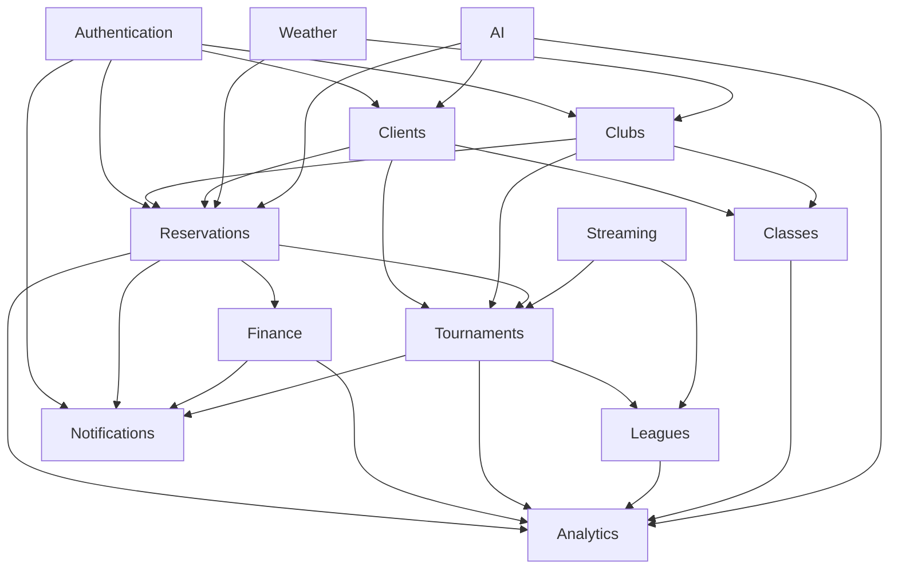

# 🏗️ Padelyzer Module Architecture

> Complete overview of all modules in the Padelyzer ecosystem

## 📊 Module Overview

### Implementation Status
```dataview
TABLE WITHOUT ID
  file.link as Module,
  status as Status,
  completion as "% Complete",
  priority as Priority
FROM "Modules"
WHERE file.name != "README"
SORT priority DESC, completion DESC
```

## 🏢 Core Business Modules

### 🎾 Clubs Management
- **Location**: `backend/apps/clubs/`
- **Status**: ✅ Implemented (95%)
- **Purpose**: Club profiles, court management, staff administration
- **Key Features**: Multi-club support, court scheduling, maintenance tracking
- **Documentation**: [[Modules/Clubs/README]]

### 📅 Reservations System  
- **Location**: `backend/apps/reservations/`
- **Status**: ✅ Implemented (92%)
- **Purpose**: Court booking, availability management, cancellation handling
- **Key Features**: Real-time availability, recurring bookings, waitlist management
- **Documentation**: [[Modules/Reservations/README]]

### 👥 Client Management
- **Location**: `backend/apps/clients/`  
- **Status**: ✅ Implemented (88%)
- **Purpose**: Player profiles, skill tracking, partner matching
- **Key Features**: Player statistics, skill ratings, social features
- **Documentation**: [[Modules/Clients/README]]

### 💰 Finance & Payments
- **Location**: `backend/apps/finance/`
- **Status**: ✅ Implemented (85%)
- **Purpose**: Payment processing, billing, revenue tracking
- **Key Features**: Stripe integration, subscription management, invoicing
- **Documentation**: [[Modules/Finance/README]]

## 🎯 Competition Modules

### 🏆 Tournaments
- **Location**: `backend/apps/tournaments/`
- **Status**: 🔄 In Progress (70%)
- **Purpose**: Tournament management, bracket generation, results tracking
- **Key Features**: Multiple tournament formats, automated scheduling
- **Documentation**: [[Modules/Tournaments/README]]

### 🎯 Leagues  
- **Location**: `backend/apps/leagues/`
- **Status**: 📋 Planned (20%)
- **Purpose**: Seasonal competitions, division management, promotion/relegation
- **Key Features**: Automated scheduling, standings calculation
- **Documentation**: [[Modules/Leagues/README]]

### 📚 Classes & Training
- **Location**: `backend/apps/classes/`
- **Status**: 🔄 In Progress (65%)
- **Purpose**: Class scheduling, instructor management, student progress
- **Key Features**: Recurring classes, skill progression tracking
- **Documentation**: [[Modules/Classes/README]]

## 🔧 Technical Modules

### 🔐 Authentication
- **Location**: `backend/apps/authentication/`
- **Status**: ✅ Implemented (98%)  
- **Purpose**: User authentication, authorization, session management
- **Key Features**: JWT tokens, role-based access, multi-factor auth
- **Documentation**: [[Modules/Authentication/README]]

### 📊 Analytics & BI
- **Location**: `backend/apps/analytics/`
- **Status**: 📋 Planned (30%)
- **Purpose**: Business intelligence, reporting, predictive analytics
- **Key Features**: Real-time dashboards, automated reports
- **Documentation**: [[Modules/Analytics/README]]

### 📧 Notifications
- **Location**: `backend/apps/notifications/`
- **Status**: 🔄 In Progress (60%)
- **Purpose**: Email, SMS, and push notification delivery
- **Key Features**: Template management, scheduling, delivery tracking
- **Documentation**: [[Modules/Notifications/README]]

### 🔍 Audit & Logging
- **Location**: `backend/apps/audit/`
- **Status**: ✅ Implemented (80%)
- **Purpose**: Security audit trails, system logging, compliance
- **Key Features**: Comprehensive logging, data retention policies
- **Documentation**: [[Modules/Audit/README]]

## 🎨 Frontend Modules

### 🖥️ Dashboard
- **Location**: `frontend/src/app/[locale]/(dashboard)/`
- **Status**: ✅ Implemented (90%)
- **Purpose**: Main administrative interface
- **Key Features**: Responsive design, real-time updates
- **Documentation**: [[Modules/Frontend/Dashboard]]

### 📱 Mobile PWA
- **Location**: `frontend/src/components/mobile/`
- **Status**: 📋 Planned (15%)
- **Purpose**: Mobile-optimized experience, offline capabilities
- **Key Features**: PWA functionality, touch-optimized UI
- **Documentation**: [[Modules/Frontend/Mobile]]

### 🎨 UI Components
- **Location**: `frontend/src/components/ui/`
- **Status**: ✅ Implemented (85%)
- **Purpose**: Reusable UI components, design system
- **Key Features**: Shadcn/ui integration, theming support
- **Documentation**: [[Modules/Frontend/Components]]

## 🔄 Integration Modules

### 🌤️ Weather Integration
- **Location**: `backend/apps/weather/`
- **Status**: 📋 Planned (0%)
- **Purpose**: Weather data for outdoor court management
- **Key Features**: Weather API integration, court availability updates
- **Documentation**: [[Modules/Integrations/Weather]]

### 📺 Streaming
- **Location**: `backend/apps/streaming/`
- **Status**: 📋 Planned (0%)
- **Purpose**: Live streaming for tournaments and special events
- **Key Features**: Multi-camera support, recording, highlights
- **Documentation**: [[Modules/Integrations/Streaming]]

### 🤖 AI Features
- **Location**: `backend/apps/ai/`
- **Status**: 📋 Planned (0%)
- **Purpose**: Machine learning features, predictive analytics
- **Key Features**: Partner matching, demand prediction, insights
- **Documentation**: [[Modules/AI/README]]

## 📈 Module Dependencies

### Dependency Graph


## 🚦 Module Status Legend

- ✅ **Implemented** (80-100%): Production ready, minor tweaks needed
- 🔄 **In Progress** (40-79%): Core functionality exists, features being added
- 📋 **Planned** (0-39%): Design complete, implementation starting
- ⏸️ **Blocked**: Waiting for dependencies or resources
- ❌ **Deprecated**: Being phased out or replaced

## 🎯 Sprint Assignments

### Current Sprint (16) - Foundation
- **Analytics/BI Module**: BI Dashboard implementation
- **Leagues Module**: Core scheduling engine
- **Performance**: Cross-module optimization

### Next Sprint (17) - Mobile PWA  
- **Frontend Mobile**: PWA implementation
- **Notifications**: Push notification system
- **Performance**: Mobile optimization

### Sprint 18 - Advanced Features
- **AI Module**: Partner matching, dynamic pricing
- **Streaming**: Live tournament streaming
- **Analytics**: Advanced predictive features

## 📊 Development Guidelines

### Module Standards
- Each module must have comprehensive README documentation
- API endpoints documented with OpenAPI/Swagger
- Minimum 85% test coverage required
- Follow Django best practices and project conventions
- Frontend components use TypeScript and follow design system

### Integration Standards
- All modules communicate via REST APIs
- Event-driven architecture for real-time features
- Consistent error handling and response formats
- Proper authentication and authorization checks
- Performance considerations for cross-module calls

### Testing Standards
- Unit tests for all business logic
- Integration tests for module interactions
- E2E tests for critical user workflows
- Performance tests for high-traffic endpoints
- Security tests for sensitive operations

## 🔍 Module Health Monitoring

### Key Metrics per Module
- **API Response Time**: <200ms average
- **Error Rate**: <1% for critical endpoints
- **Test Coverage**: >85% for all modules
- **Code Quality**: A grade on SonarQube
- **Security**: Zero high-severity vulnerabilities

### Monitoring Dashboards
- Real-time module performance metrics
- API endpoint health and response times
- Database query performance per module
- User activity and feature adoption
- Error tracking and alerting

---

## 📚 Quick Links

- [[Sprint Dashboard]] - Current development status
- [[Tasks/README]] - Task management system  
- [[Progress/README]] - Sprint reviews and metrics
- [API Documentation](http://localhost:8000/api/docs/) - Swagger UI
- [Frontend Storybook](http://localhost:3000/storybook) - Component library

---

*Module architecture designed for scalability and maintainability*
*Each module operates independently with clear boundaries*