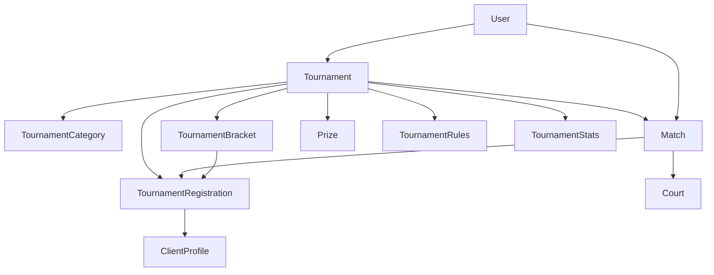

# 🏆 Tournaments Module - Complete Documentation

> **Comprehensive tournament management system with bracket generation, match scheduling, and advanced competition features**

## 📊 Module Overview

### Status Dashboard
- **Implementation Status**: ✅ **70% Complete** - Advanced tournament engine built
- **Production Readiness**: 🟡 **In Progress** - Core functionality ready, needs testing
- **Critical Features**: 6/10 Complete
- **Business Priority**: Medium - Competitive features for player engagement

### Key Features
- **Tournament Management**: Complete tournament lifecycle management
- **Multiple Formats**: Elimination, round-robin, Swiss system, double elimination
- **Bracket Generation**: Automated bracket creation and management
- **Match Scheduling**: Court assignment and timing coordination
- **Prize Management**: Comprehensive prize structure and distribution
- **Player Eligibility**: Advanced category and skill-based filtering
- **Real-time Scoring**: Live match scoring and result tracking

---

## 🏗️ Architecture Overview

### Core Components


### Module Structure
```
apps/tournaments/
├── models.py          # ✅ Core tournament models (8 models)
├── views.py           # ✅ Tournament API ViewSets
├── serializers.py     # ✅ Data serialization
├── urls.py            # ✅ API routing
├── services.py        # ✅ Bracket generation services
├── managers.py        # ✅ Custom model managers
├── admin.py           # ✅ Django admin interface
├── migrations/        # ✅ Database migrations
└── tests/             # 🔄 Test coverage (needs expansion)
```

---

## 📋 Data Models

### 1. 🎯 TournamentCategory Model
**Purpose**: Tournament categorization and player eligibility system

```python
class TournamentCategory(BaseModel):
    CATEGORY_TYPE_CHOICES = [
        ("level", "Por Nivel"),           # Skill-based categories
        ("age", "Por Edad"),              # Age-based categories
        ("gender", "Por Género"),         # Gender-based categories
        ("mixed", "Mixta"),               # Mixed categories
        ("open", "Abierta"),              # Open to all
    ]
```

**Key Fields**:
- `category_type`: Type of tournament categorization
- `min_age` / `max_age`: Age restrictions (5-80 years)
- `min_level` / `max_level`: Skill level restrictions (ForeignKey to PlayerLevel)
- `gender`: Gender restrictions (male/female/mixed/any)
- `color` / `icon`: Visual representation for UI

**Business Logic**:
```python
def is_player_eligible(self, player_profile):
    """Comprehensive eligibility checking"""
    # Age verification
    if self.min_age or self.max_age:
        age = calculate_age(player_profile.birth_date)
        if not (self.min_age <= age <= self.max_age):
            return False
    
    # Skill level verification
    if self.min_level and player_profile.level:
        if player_profile.level.min_rating < self.min_level.min_rating:
            return False
    
    # Gender verification
    if self.gender != "any" and self.gender != player_profile.user.gender:
        return False
        
    return True
```

### 2. 🏆 Tournament Model (Core)
**Purpose**: Main tournament management and configuration

**Essential Fields**:
```python
# Tournament Configuration
name = CharField(max_length=200)                    # Tournament name
format = CharField(choices=FORMAT_CHOICES)          # Tournament format
category = ForeignKey(TournamentCategory)           # Player category
max_teams = IntegerField(4-256)                     # Team capacity
registration_fee = DecimalField()                   # Entry fee

# Dates and Timing
start_date = DateField()                            # Tournament start
end_date = DateField()                              # Tournament end
registration_start = DateTimeField()               # Registration opens
registration_end = DateTimeField()                 # Registration closes

# Status Management
STATUS_CHOICES = [
    ("draft", "Borrador"),                          # Planning phase
    ("published", "Publicado"),                     # Published but not open
    ("registration_open", "Inscripciones Abiertas"), # Accepting registrations
    ("registration_closed", "Inscripciones Cerradas"), # Full or deadline reached
    ("in_progress", "En Progreso"),                 # Tournament active
    ("completed", "Completado"),                    # Tournament finished
    ("cancelled", "Cancelado"),                     # Tournament cancelled
]
```

**Tournament Formats**:
```python
FORMAT_CHOICES = [
    ("elimination", "Eliminación"),                 # Single elimination
    ("round_robin", "Todos contra Todos"),          # Round-robin
    ("swiss", "Sistema Suizo"),                     # Swiss system
    ("double_elimination", "Doble Eliminación"),    # Double elimination
]
```

**Key Properties**:
```python
@property
def is_registration_open(self):
    """Check if registration is currently accepting entries"""
    now = timezone.now()
    return (self.status in ["published", "registration_open"] and
            self.registration_start <= now <= self.registration_end)

@property
def current_teams_count(self):
    """Get current number of confirmed teams"""
    return self.registrations.filter(status="confirmed").count()

@property
def can_start(self):
    """Check if tournament meets minimum requirements to start"""
    return (self.status == "registration_closed" and 
            self.current_teams_count >= self.min_teams)
```

**Tournament Management Methods**:
```python
def calculate_total_rounds(self):
    """Calculate rounds based on format and team count"""
    teams = self.current_teams_count
    
    if self.format == "elimination":
        return math.ceil(math.log2(teams))
    elif self.format == "double_elimination":
        return (math.ceil(math.log2(teams)) * 2) - 1
    elif self.format == "round_robin":
        return teams - 1
    elif self.format == "swiss":
        return math.ceil(math.log2(teams))

def start_tournament(self):
    """Initialize tournament and generate bracket"""
    if not self.can_start:
        raise ValidationError("Tournament cannot start yet")
        
    self.status = "in_progress"
    self.total_rounds = self.calculate_total_rounds()
    self.current_round = 1
    self.save()
    
    self.generate_bracket()
```

### 3. 👥 TournamentRegistration Model
**Purpose**: Team registration and player management

```python
class TournamentRegistration(BaseModel):
    # Team Configuration
    tournament = ForeignKey(Tournament)
    team_name = CharField(max_length=100)           # Custom team name
    
    # Player Roster
    player1 = ForeignKey(ClientProfile)             # Primary player
    player2 = ForeignKey(ClientProfile)             # Partner player
    substitute1 = ForeignKey(ClientProfile, null=True) # Optional substitute
    substitute2 = ForeignKey(ClientProfile, null=True) # Optional substitute
    
    # Registration Management
    STATUS_CHOICES = [
        ("pending", "Pendiente"),                   # Awaiting approval
        ("confirmed", "Confirmada"),                # Confirmed and paid
        ("waitlist", "Lista de Espera"),            # Tournament full
        ("rejected", "Rechazada"),                  # Not eligible/approved
        ("cancelled", "Cancelada"),                 # Cancelled by team
    ]
    
    # Payment Integration
    payment_status = CharField(choices=[
        ("pending", "Pendiente"),
        ("paid", "Pagado"),
        ("refunded", "Reembolsado"),
    ])
```

**Business Logic**:
```python
def clean(self):
    """Validation for team registration"""
    if self.player1 == self.player2:
        raise ValidationError("Player 1 and Player 2 cannot be the same")
    
    # Check player eligibility
    if not self.tournament.category.is_player_eligible(self.player1):
        raise ValidationError(f"{self.player1} is not eligible for this category")
    if not self.tournament.category.is_player_eligible(self.player2):
        raise ValidationError(f"{self.player2} is not eligible for this category")

def confirm_registration(self):
    """Process registration confirmation"""
    if self.status == "pending":
        if self.tournament.is_full:
            self.status = "waitlist"
        else:
            self.status = "confirmed"
        self.save()
```

### 4. 🗂️ TournamentBracket Model
**Purpose**: Tournament bracket structure and progression

```python
class TournamentBracket(BaseModel):
    tournament = ForeignKey(Tournament)
    round_number = IntegerField()                   # Tournament round
    position = IntegerField()                       # Position in round
    
    # Team Assignments
    team1 = ForeignKey(TournamentRegistration, null=True)
    team2 = ForeignKey(TournamentRegistration, null=True)
    
    # Bracket Progression
    advances_to = ForeignKey('self', null=True)     # Next bracket position
    match = OneToOneField('Match', null=True)       # Associated match
    
    # Double Elimination Support
    is_losers_bracket = BooleanField(default=False) # Losers bracket flag
```

### 5. ⚔️ Match Model (Core)
**Purpose**: Individual match management and scoring

```python
class Match(MultiTenantModel):
    # Match Configuration
    tournament = ForeignKey(Tournament)
    round_number = IntegerField()                   # Tournament round
    match_number = IntegerField()                   # Match within round
    
    # Teams and Scheduling
    team1 = ForeignKey(TournamentRegistration)
    team2 = ForeignKey(TournamentRegistration)
    scheduled_date = DateTimeField()                # Scheduled match time
    court = ForeignKey(Court, null=True)            # Assigned court
    
    # Match Status
    STATUS_CHOICES = [
        ("scheduled", "Programado"),                # Ready to play
        ("in_progress", "En Progreso"),             # Currently playing
        ("completed", "Completado"),                # Match finished
        ("walkover", "Walkover"),                   # One team didn't show
        ("cancelled", "Cancelado"),                 # Match cancelled
        ("postponed", "Pospuesto"),                 # Rescheduled
    ]
    
    # Scoring System
    team1_score = JSONField(default=list)           # [6, 4, 6] (sets)
    team2_score = JSONField(default=list)           # [4, 6, 2] (sets)
    winner = ForeignKey(TournamentRegistration, null=True)
    
    # Timing Tracking
    actual_start_time = DateTimeField(null=True)
    actual_end_time = DateTimeField(null=True)
    duration_minutes = IntegerField(null=True)
```

**Scoring Methods**:
```python
def record_set_score(self, team1_games, team2_games):
    """Record score for completed set"""
    if not self.team1_score:
        self.team1_score = []
    if not self.team2_score:
        self.team2_score = []
        
    self.team1_score.append(team1_games)
    self.team2_score.append(team2_games)
    self.save()
    
    # Check if match is complete
    format_sets = 3 if self.tournament.match_format == "best_of_3" else 5
    if self.team1_sets_won > format_sets // 2 or self.team2_sets_won > format_sets // 2:
        self.determine_winner()

def determine_winner(self):
    """Determine match winner based on sets won"""
    if self.team1_sets_won > self.team2_sets_won:
        self.winner = self.team1
    elif self.team2_sets_won > self.team1_sets_won:
        self.winner = self.team2
        
    if self.winner:
        self.status = "completed"
    self.save()
```

### 6. 🏅 Prize Model
**Purpose**: Prize structure and distribution management

```python
class Prize(BaseModel):
    tournament = ForeignKey(Tournament)
    
    # Prize Configuration
    position = IntegerField(1-10)                   # Placement (1st, 2nd, etc.)
    name = CharField(max_length=100)                # Prize name
    prize_type = CharField(choices=[
        ("cash", "Efectivo"),                       # Cash prizes
        ("trophy", "Trofeo"),                       # Physical trophies
        ("medal", "Medalla"),                       # Medals
        ("merchandise", "Mercancía"),               # Club merchandise
        ("points", "Puntos"),                       # Rating points
        ("other", "Otro"),                          # Custom prizes
    ])
    
    # Prize Values
    cash_value = DecimalField(null=True)            # Monetary value
    points_value = IntegerField(null=True)          # Point value
    
    # Prize Distribution
    awarded_to = ForeignKey(TournamentRegistration, null=True)
    awarded_at = DateTimeField(null=True)
```

### 7. 📋 TournamentRules Model
**Purpose**: Tournament-specific rules and regulations

```python
class TournamentRules(BaseModel):
    tournament = ForeignKey(Tournament)
    
    RULE_TYPE_CHOICES = [
        ("scoring", "Puntuación"),                  # Scoring rules
        ("format", "Formato"),                      # Match format rules
        ("conduct", "Conducta"),                    # Player conduct
        ("equipment", "Equipamiento"),              # Equipment requirements
        ("time", "Tiempo"),                         # Time limitations
        ("other", "Otro"),                          # Custom rules
    ]
    
    rule_type = CharField(choices=RULE_TYPE_CHOICES)
    title = CharField(max_length=200)
    description = TextField()
    is_mandatory = BooleanField(default=True)
    penalty_description = TextField()
```

### 8. 📊 TournamentStats Model
**Purpose**: Comprehensive tournament analytics

```python
class TournamentStats(BaseModel):
    tournament = OneToOneField(Tournament)
    
    # Participation Analytics
    total_registrations = IntegerField(default=0)
    confirmed_teams = IntegerField(default=0)
    waitlist_teams = IntegerField(default=0)
    cancelled_registrations = IntegerField(default=0)
    
    # Match Analytics
    total_matches = IntegerField(default=0)
    completed_matches = IntegerField(default=0)
    walkover_matches = IntegerField(default=0)
    average_match_duration = IntegerField(default=0)
    
    # Financial Analytics
    total_registration_fees = DecimalField(default=0)
    total_prize_money = DecimalField(default=0)
```

---

## 🔗 API Endpoints

### Tournament Management API
```http
# Tournament CRUD
GET /api/tournaments/                             # List tournaments
POST /api/tournaments/                            # Create tournament
GET /api/tournaments/{id}/                        # Tournament details
PUT/PATCH /api/tournaments/{id}/                  # Update tournament
DELETE /api/tournaments/{id}/                     # Delete tournament

# Tournament Actions
POST /api/tournaments/{id}/publish/               # Publish tournament
POST /api/tournaments/{id}/start/                 # Start tournament
POST /api/tournaments/{id}/complete/              # Complete tournament
POST /api/tournaments/{id}/cancel/                # Cancel tournament

# Registration Management
GET /api/tournaments/{id}/registrations/          # List registrations
POST /api/tournaments/{id}/register/              # Register team
GET /api/tournaments/{id}/bracket/                # Get bracket
POST /api/tournaments/{id}/generate_bracket/      # Generate bracket

# Filtering and Search
GET /api/tournaments/?status=registration_open    # Filter by status
GET /api/tournaments/?category={id}               # Filter by category
GET /api/tournaments/?format=elimination          # Filter by format
GET /api/tournaments/?club={id}                   # Filter by club
```

### Tournament Categories API
```http
GET /api/tournaments/categories/                  # List categories
POST /api/tournaments/categories/                 # Create category
GET /api/tournaments/categories/{id}/             # Category details
PUT/PATCH /api/tournaments/categories/{id}/       # Update category

# Category Actions
GET /api/tournaments/categories/{id}/eligible_players/ # Check eligibility
POST /api/tournaments/categories/{id}/check_eligibility/ # Validate player
```

### Registration API
```http
# Team Registration
GET /api/tournaments/registrations/               # My registrations
POST /api/tournaments/registrations/              # Register for tournament
GET /api/tournaments/registrations/{id}/          # Registration details
PUT/PATCH /api/tournaments/registrations/{id}/    # Update registration
DELETE /api/tournaments/registrations/{id}/       # Cancel registration

# Registration Actions
POST /api/tournaments/registrations/{id}/confirm/ # Confirm registration
POST /api/tournaments/registrations/{id}/substitute/ # Add substitute player
POST /api/tournaments/registrations/{id}/payment/ # Process payment
```

### Match Management API
```http
# Match Operations
GET /api/tournaments/matches/                     # List matches
GET /api/tournaments/matches/{id}/                # Match details
PUT/PATCH /api/tournaments/matches/{id}/          # Update match

# Scoring Actions
POST /api/tournaments/matches/{id}/start/         # Start match
POST /api/tournaments/matches/{id}/record_set/    # Record set score
POST /api/tournaments/matches/{id}/complete/      # Complete match
POST /api/tournaments/matches/{id}/walkover/      # Record walkover

# Match Scheduling
GET /api/tournaments/matches/schedule/            # Match schedule
POST /api/tournaments/matches/{id}/reschedule/    # Reschedule match
GET /api/tournaments/matches/by_court/            # Matches by court
```

### Tournament Analytics API
```http
GET /api/tournaments/{id}/stats/                  # Tournament statistics
GET /api/tournaments/{id}/leaderboard/            # Current standings
GET /api/tournaments/{id}/results/                # Final results
GET /api/tournaments/analytics/participation/     # Participation analytics
GET /api/tournaments/analytics/revenue/           # Revenue analytics
```

---

## 🎯 Business Logic & Features

### Tournament Format Implementations

#### 1. Single Elimination
```python
def generate_elimination_bracket(teams):
    """Generate single elimination bracket"""
    rounds = math.ceil(math.log2(len(teams)))
    bracket = []
    
    # First round pairing
    for i in range(0, len(teams), 2):
        if i + 1 < len(teams):
            bracket.append({
                'round': 1,
                'position': len(bracket) + 1,
                'team1': teams[i],
                'team2': teams[i + 1]
            })
        else:
            # Bye for odd number of teams
            bracket.append({
                'round': 1,
                'position': len(bracket) + 1,
                'team1': teams[i],
                'team2': None  # Bye
            })
    
    return bracket
```

#### 2. Double Elimination
```python
def generate_double_elimination_bracket(teams):
    """Generate double elimination bracket with winners and losers brackets"""
    winners_bracket = generate_elimination_bracket(teams)
    losers_bracket = []
    
    # Losers bracket receives eliminated teams from winners bracket
    for round_num in range(1, math.ceil(math.log2(len(teams)))):
        losers_matches = create_losers_round_matches(round_num)
        losers_bracket.extend(losers_matches)
    
    return {
        'winners_bracket': winners_bracket,
        'losers_bracket': losers_bracket,
        'grand_final': create_grand_final()
    }
```

#### 3. Round Robin
```python
def generate_round_robin_schedule(teams):
    """Generate round robin where each team plays every other team"""
    matches = []
    for i, team1 in enumerate(teams):
        for j, team2 in enumerate(teams[i+1:], i+1):
            matches.append({
                'round': calculate_round_robin_round(i, j, len(teams)),
                'team1': team1,
                'team2': team2
            })
    return matches
```

#### 4. Swiss System
```python
def generate_swiss_round(teams, round_number, previous_results):
    """Generate Swiss system round based on current standings"""
    # Sort teams by points and tiebreakers
    standings = calculate_swiss_standings(teams, previous_results)
    
    # Pair teams with similar standings
    matches = []
    paired = set()
    
    for i, team in enumerate(standings):
        if team not in paired:
            # Find best opponent not yet played against
            opponent = find_swiss_opponent(team, standings[i+1:], previous_results)
            if opponent:
                matches.append({'team1': team, 'team2': opponent})
                paired.update([team, opponent])
    
    return matches
```

### Prize Distribution System
```python
class PrizeDistribution:
    def distribute_prizes(self, tournament):
        """Distribute prizes based on final standings"""
        final_standings = self.calculate_final_standings(tournament)
        prizes = tournament.prizes.order_by('position')
        
        for prize in prizes:
            if prize.position <= len(final_standings):
                winning_team = final_standings[prize.position - 1]
                prize.award_to_team(winning_team)
                
                # Update player ratings/points if applicable
                if prize.points_value:
                    self.award_rating_points(winning_team, prize.points_value)
    
    def calculate_final_standings(self, tournament):
        """Calculate final tournament standings"""
        if tournament.format == "elimination":
            return self.calculate_elimination_standings(tournament)
        elif tournament.format == "round_robin":
            return self.calculate_round_robin_standings(tournament)
        elif tournament.format == "swiss":
            return self.calculate_swiss_standings(tournament)
```

### Player Eligibility System
```python
class EligibilityChecker:
    def check_tournament_eligibility(self, player, tournament):
        """Comprehensive eligibility check"""
        category = tournament.category
        
        # Age eligibility
        if not self.check_age_eligibility(player, category):
            return False, "Player does not meet age requirements"
        
        # Skill level eligibility
        if not self.check_skill_eligibility(player, category):
            return False, "Player skill level outside tournament category"
        
        # Gender eligibility
        if not self.check_gender_eligibility(player, category):
            return False, "Player gender not eligible for this category"
        
        # Club membership (if required)
        if tournament.visibility == "members_only":
            if not self.check_club_membership(player, tournament.club):
                return False, "Tournament restricted to club members"
        
        return True, "Player is eligible"
```

---

## 🔒 Security & Permissions

### Tournament Management Permissions
```python
class TournamentPermissions:
    """Tournament-specific permission system"""
    
    def can_create_tournament(self, user, club):
        """Check tournament creation permissions"""
        return (user.is_staff or 
                user.is_club_admin(club) or 
                user.has_permission('tournaments.add_tournament'))
    
    def can_manage_tournament(self, user, tournament):
        """Check tournament management permissions"""
        return (user == tournament.organizer or
                user.is_club_admin(tournament.club) or
                user.is_staff)
    
    def can_register_for_tournament(self, user, tournament):
        """Check registration permissions"""
        # Must have client profile
        if not hasattr(user, 'client_profile'):
            return False
        
        # Check tournament visibility
        if tournament.visibility == "private":
            return self.can_manage_tournament(user, tournament)
        elif tournament.visibility == "members_only":
            return user.client_profile.club == tournament.club
        
        # Public tournament
        return True
    
    def can_update_match_score(self, user, match):
        """Check match scoring permissions"""
        return (self.can_manage_tournament(user, match.tournament) or
                user == match.referee or
                user in [match.team1.player1.user, match.team1.player2.user,
                        match.team2.player1.user, match.team2.player2.user])
```

### Data Privacy & Multi-tenancy
```python
# All tournament models inherit multi-tenancy
class Tournament(MultiTenantModel):
    # Automatic organization/club filtering
    pass

# Permission enforcement in ViewSets
class TournamentViewSet(MultiTenantViewMixin, viewsets.ModelViewSet):
    def get_queryset(self):
        queryset = super().get_queryset()
        
        # Filter based on user permissions
        if not self.request.user.is_staff:
            # Regular users see public tournaments or ones from their club
            queryset = queryset.filter(
                Q(visibility="public") |
                Q(club=self.request.user.client_profile.club)
            )
        
        return queryset
```

---

## 🎨 Frontend Integration

### Tournament Components
```typescript
// Core Tournament Components
<TournamentCard tournament={tournament} showActions={canManage} />
<TournamentDetails tournament={tournament} />
<TournamentBracket bracket={bracketData} />
<RegistrationForm tournament={tournament} onSubmit={handleRegister} />

// Match Management
<MatchCard match={match} showScoring={canScore} />
<ScoreInput match={match} onScoreUpdate={updateScore} />
<MatchSchedule matches={todayMatches} />

// Tournament Creation
<TournamentWizard onComplete={createTournament} />
<CategorySelector categories={categories} onSelect={setCategory} />
<PrizeStructure prizes={prizes} onChange={updatePrizes} />

// Analytics & Reporting
<TournamentStats stats={tournamentStats} />
<LeaderBoard standings={standings} />
<ParticipationChart data={participationData} />
```

### State Management
```typescript
interface TournamentsStore {
  // Tournament Management
  tournaments: Tournament[]
  currentTournament: Tournament | null
  createTournament: (data: TournamentData) => Promise<Tournament>
  updateTournament: (id: string, data: Partial<Tournament>) => Promise<void>
  
  // Registration Management
  myRegistrations: TournamentRegistration[]
  registerForTournament: (tournamentId: string, teamData: TeamData) => Promise<void>
  withdrawFromTournament: (registrationId: string) => Promise<void>
  
  // Match Management
  matches: Match[]
  updateMatchScore: (matchId: string, scoreData: ScoreData) => Promise<void>
  
  // Bracket Management
  bracket: BracketData | null
  generateBracket: (tournamentId: string) => Promise<void>
  
  // Analytics
  tournamentStats: TournamentStats | null
  fetchTournamentStats: (tournamentId: string) => Promise<void>
}
```

---

## 📊 Performance Optimizations

### Database Optimizations
```python
# Optimized querysets for tournament operations
def get_tournament_with_details(tournament_id):
    return Tournament.objects.select_related(
        'category', 'organizer', 'club', 'stats'
    ).prefetch_related(
        'registrations__player1__user',
        'registrations__player2__user',
        'matches__team1',
        'matches__team2',
        'brackets__team1',
        'brackets__team2',
        'prizes'
    ).get(id=tournament_id)

# Indexes for performance
class Meta:
    indexes = [
        models.Index(fields=['club', 'status', 'start_date']),
        models.Index(fields=['category', 'status']),
        models.Index(fields=['organizer', 'status']),
        models.Index(fields=['tournament', 'status']),  # For matches
        models.Index(fields=['scheduled_date', 'court']),  # For scheduling
    ]
```

### Caching Strategy
- **Tournament Lists**: Cache public tournaments for 30 minutes
- **Brackets**: Cache bracket structure for 15 minutes
- **Match Schedules**: Cache daily schedules for 10 minutes
- **Statistics**: Cache tournament stats for 1 hour
- **Leaderboards**: Cache standings for 5 minutes during active tournaments

### Background Processing
```python
# Celery tasks for heavy operations
@celery_app.task
def generate_tournament_bracket(tournament_id):
    """Generate tournament bracket in background"""
    tournament = Tournament.objects.get(id=tournament_id)
    generator = TournamentBracketGenerator(tournament)
    generator.generate()
    
    # Send notifications to participants
    notify_tournament_started.delay(tournament_id)

@celery_app.task  
def update_tournament_statistics(tournament_id):
    """Update tournament statistics"""
    tournament = Tournament.objects.get(id=tournament_id)
    stats, created = TournamentStats.objects.get_or_create(tournament=tournament)
    stats.update_stats()
```

---

## 🧪 Testing Strategy

### Test Coverage Areas
```python
# Model Tests
class TournamentModelTests(TestCase):
    def test_tournament_creation()               # Basic creation
    def test_bracket_generation()               # Bracket algorithms
    def test_eligibility_checking()             # Player eligibility
    def test_tournament_progression()           # Status transitions
    
class MatchModelTests(TestCase):
    def test_match_scoring()                    # Score recording
    def test_winner_determination()             # Winner calculation
    def test_tournament_advancement()           # Bracket progression
    
class RegistrationTests(TestCase):
    def test_registration_workflow()            # Full registration flow
    def test_capacity_management()              # Tournament capacity
    def test_payment_integration()              # Payment processing

# API Tests  
class TournamentAPITests(APITestCase):
    def test_tournament_crud()                  # Full CRUD operations
    def test_registration_process()             # Registration workflow
    def test_bracket_generation()               # Bracket API
    def test_match_scoring()                    # Scoring API
    def test_permission_enforcement()           # Security testing
    
# Integration Tests
class TournamentIntegrationTests(TransactionTestCase):
    def test_complete_tournament_flow()         # Full tournament lifecycle
    def test_multi_format_tournaments()         # Different tournament types
    def test_concurrent_registrations()         # Race condition handling
```

### Critical Test Scenarios
1. **Tournament Lifecycle**: Complete tournament from creation to completion
2. **Bracket Generation**: All tournament formats work correctly
3. **Registration Management**: Capacity, eligibility, and payment handling
4. **Match Scoring**: Accurate score recording and winner determination
5. **Permission Security**: Proper access control throughout
6. **Multi-tenancy**: Data isolation between organizations

---

## 🚀 Integration Points

### With Other Modules

#### Clients Module Integration
```python
# Player eligibility and registration
class TournamentRegistration(BaseModel):
    player1 = ForeignKey(ClientProfile)
    player2 = ForeignKey(ClientProfile)
    
    def clean(self):
        # Use client profile eligibility checking
        if not self.tournament.category.is_player_eligible(self.player1):
            raise ValidationError("Player 1 not eligible")
```

#### Clubs Module Integration
```python
# Tournament venue and court assignment
class Tournament(MultiTenantModel):
    club = ForeignKey(Club)  # Host club
    
class Match(MultiTenantModel):
    court = ForeignKey(Court, null=True)  # Assigned court
    
def schedule_matches(self, tournament):
    """Schedule matches on available courts"""
    available_courts = Court.objects.filter(
        club=tournament.club,
        is_active=True
    )
    return self.assign_courts_to_matches(tournament.matches, available_courts)
```

#### Finance Module Integration
```python
# Tournament registration fees and prize money
class Payment(BaseModel):
    tournament_registration = ForeignKey(TournamentRegistration, null=True)
    
def process_tournament_registration(registration):
    """Process registration payment"""
    if registration.tournament.requires_payment:
        payment = Payment.objects.create(
            amount=registration.tournament.registration_fee,
            payment_type='tournament',
            client=registration.player1,
            tournament_registration=registration
        )
        return payment.process()
```

#### Reservations Module Integration
```python
# Tournament matches reserve courts automatically
class Match(MultiTenantModel):
    def create_court_reservation(self):
        """Create automatic court reservation for tournament match"""
        from apps.reservations.models import Reservation
        
        if self.court and self.scheduled_date:
            reservation = Reservation.objects.create(
                court=self.court,
                date=self.scheduled_date.date(),
                start_time=self.scheduled_date.time(),
                duration=120,  # 2 hours default
                client=self.team1.player1,
                status='confirmed',
                booking_type='tournament',
                tournament_match=self
            )
            return reservation
```

---

## 🔧 Configuration & Setup

### Tournament Settings
```python
# Tournament module configuration
TOURNAMENTS_CONFIG = {
    'AUTO_GENERATE_BRACKET': True,           # Auto-generate on tournament start
    'ALLOW_LATE_REGISTRATION': False,       # Allow registration after deadline
    'DEFAULT_MATCH_DURATION': 120,          # Minutes
    'MAX_TOURNAMENT_CAPACITY': 256,         # Maximum teams per tournament
    'REQUIRE_PAYMENT_CONFIRMATION': True,   # Payment required for confirmation
    'ENABLE_DOUBLE_ELIMINATION': True,      # Enable double elimination format
    'ENABLE_SWISS_SYSTEM': True,            # Enable Swiss system format
    'AUTO_ADVANCE_WALKOVER': True,          # Auto-advance walkover winners
}

# Bracket generation settings
BRACKET_CONFIG = {
    'SEEDING_STRATEGY': 'rating_based',     # How to seed teams
    'RANDOMIZE_EQUAL_SEEDS': True,          # Randomize teams with same rating
    'BYE_DISTRIBUTION': 'top_seeds',        # Give byes to highest seeds
    'SCHEDULE_OPTIMIZATION': True,          # Optimize match scheduling
}
```

### Required Dependencies
```python
# Additional requirements for tournaments
REQUIRED_PACKAGES = [
    'python-dateutil>=2.8.0',  # Date/time manipulation
    'celery>=5.0.0',            # Background task processing
    'redis>=3.5.0',             # Caching and task queue
]

# Tournament-specific permissions
TOURNAMENT_PERMISSIONS = [
    'tournaments.add_tournament',
    'tournaments.change_tournament',
    'tournaments.delete_tournament',
    'tournaments.manage_registrations',
    'tournaments.score_matches',
    'tournaments.award_prizes',
]
```

---

## 🐛 Known Issues & Limitations

### Current Limitations
1. **Live Scoring**: Basic scoring implementation (needs real-time updates)
2. **Advanced Statistics**: Limited analytics (needs match-level data)
3. **Video Integration**: No video streaming support for matches
4. **Mobile Optimization**: Desktop-focused UI (needs mobile enhancement)
5. **Notification System**: Basic notifications (needs push notifications)

### Planned Improvements
1. **Real-time Features**: Live scoring updates, bracket changes
2. **Advanced Analytics**: Heat maps, performance trends, predictions
3. **Social Integration**: Tournament chat, photo sharing, highlights
4. **Mobile App**: Native mobile tournament experience
5. **Streaming Support**: Live match streaming and recording

---

## 📈 Metrics & Analytics

### Tournament KPIs
```python
# Business Metrics
def calculate_tournament_metrics():
    return {
        'total_tournaments': Tournament.objects.count(),
        'active_tournaments': Tournament.objects.filter(status='in_progress').count(),
        'average_participants': Tournament.objects.aggregate(
            avg_participants=Avg('registrations__count')
        )['avg_participants'],
        'tournament_completion_rate': calculate_completion_rate(),
        'revenue_per_tournament': calculate_average_revenue(),
        'player_retention_rate': calculate_retention_rate()
    }

# Engagement Metrics
def calculate_engagement_metrics():
    return {
        'repeat_participants': calculate_repeat_participants(),
        'tournament_frequency': calculate_tournament_frequency(),
        'average_match_duration': calculate_avg_match_duration(),
        'no_show_rate': calculate_no_show_rate(),
        'prize_claim_rate': calculate_prize_claim_rate()
    }
```

### Dashboard Analytics
- **Tournament Performance**: Completion rates, participant satisfaction
- **Player Engagement**: Participation frequency, skill progression
- **Revenue Tracking**: Registration fees, prize money distribution
- **Operational Metrics**: Court utilization, scheduling efficiency
- **Growth Indicators**: New tournament formats, expanding participation

---

## 🎯 Roadmap & Future Enhancements

### Phase 1: MVP Completion (Current)
- [x] Core tournament management
- [x] Multiple tournament formats
- [x] Basic bracket generation
- [ ] Complete match scoring
- [ ] Prize distribution
- [ ] Performance optimization

### Phase 2: Advanced Features
- [ ] Real-time live scoring
- [ ] Advanced tournament analytics
- [ ] Tournament streaming integration
- [ ] Mobile app optimization
- [ ] Social features expansion

### Phase 3: Professional Features
- [ ] Professional tournament management
- [ ] Ranking system integration
- [ ] Sponsor and partnership management
- [ ] Advanced scheduling algorithms
- [ ] Tournament series and circuits

### Phase 4: AI & Intelligence
- [ ] AI-powered bracket seeding
- [ ] Performance prediction algorithms
- [ ] Intelligent match scheduling
- [ ] Player development insights
- [ ] Tournament outcome predictions

---

## 👥 Team & Ownership

**Module Owner**: Tournaments Module Specialist Agent  
**Primary Developer**: Backend Team Lead  
**Frontend Integration**: Frontend Team  
**Quality Assurance**: QA Team + Automated Testing  

**Key Stakeholders**:
- Club Owners (tournament hosting, revenue generation)
- Tournament Directors (event management)
- Players (competitive opportunities)
- Sponsors (marketing and partnerships)

---

**📝 Documentation Status**: Complete  
**🔄 Last Updated**: January 11, 2025  
**📊 Module Health**: 70% - Good foundation, needs completion  
**🎯 Next Milestone**: Complete match scoring and prize distribution for MVP

*This documentation serves as the complete reference for the Tournaments module, covering all aspects from technical implementation to business requirements and future roadmap.*