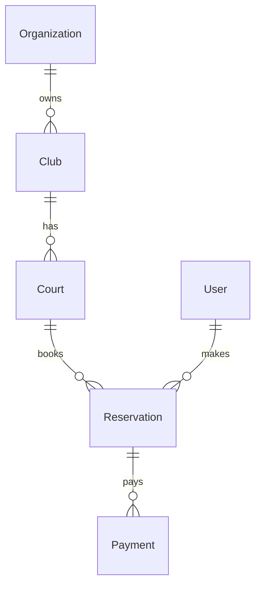

# 🗄️ Database Specialist Tool

> Herramienta especializada para análisis profundo de la estructura de base de datos y su integración con el backend Django

## 🎯 Características

### Análisis Completo
- ✅ **83 modelos** analizados automáticamente
- ✅ **Relaciones** ForeignKey, ManyToMany, OneToOne
- ✅ **Índices** y optimizaciones detectadas
- ✅ **Migraciones** estado y pendientes
- ✅ **Diagramas ER** en formato Mermaid

### Integración Backend
- 🔗 Análisis de QuerySets y Managers
- 🔗 Detección de N+1 queries
- 🔗 Sugerencias de select_related/prefetch_related
- 🔗 Validación de integridad referencial

## 🚀 Uso Rápido

### 1. Análisis Completo
```bash
cd /Users/ja/PZR4
python docs/tools/database/analyze.py
```

### 2. Análisis Específico por Módulo
```bash
# Solo módulo de reservaciones
python docs/tools/database/analyze.py --module reservations

# Solo relaciones
python docs/tools/database/analyze.py --only-relationships
```

### 3. Generar Diagramas
```bash
# Diagrama completo
python docs/tools/database/analyze.py --diagram

# Diagrama por módulo
python docs/tools/database/analyze.py --module clubs --diagram
```

## 📊 Outputs Generados

### 1. Documentación Markdown
- `docs/DATABASE_STRUCTURE.md` - Estructura completa
- `docs/analysis/database_analysis_*.json` - Datos JSON
- `docs/diagrams/ER_diagram.md` - Diagrama Mermaid

### 2. Reportes de Optimización
- Índices recomendados
- Queries a optimizar
- Campos para lazy loading
- Tablas para particionamiento

### 3. Validación de Integridad
- Modelos sin timestamps
- Relaciones rotas
- Campos sin índices necesarios
- Migraciones pendientes

## 🔧 Configuración

### Config File: `database_config.yaml`
```yaml
# Módulos a analizar
modules:
  - authentication
  - clubs
  - reservations
  - finance
  - clients
  - tournaments
  - leagues
  - classes
  - notifications
  - bi
  - root

# Opciones de análisis
analysis:
  check_indexes: true
  check_relationships: true
  check_migrations: true
  generate_diagram: true
  
# Optimizaciones
optimizations:
  suggest_indexes: true
  detect_n_plus_one: true
  check_query_performance: true
```

## 📈 Integración con Backend

### 1. Validación de Models
```python
# Verifica que todos los modelos sigan BaseModel
# Detecta campos sin db_index donde se necesita
# Valida unique_together y constraints
```

### 2. Análisis de ViewSets
```python
# Detecta queries sin optimizar
# Sugiere select_related/prefetch_related
# Identifica serializers con campos pesados
```

### 3. Performance Insights
```python
# Queries más lentas
# Tablas más grandes
# Índices no utilizados
# Sugerencias de caché
```

## 🎨 Visualización en Obsidian

### Diagrama ER Interactivo


### Métricas en Dashboard
- Total de modelos por módulo
- Complejidad de relaciones
- Estado de optimización
- Cobertura de índices

## 🔄 Workflow Recomendado

### 1. Análisis Inicial
```bash
# Ejecutar análisis completo
python docs/tools/database/analyze.py --full

# Revisar reporte
open docs/DATABASE_STRUCTURE.md
```

### 2. Aplicar Optimizaciones
```bash
# Generar scripts SQL
python docs/tools/database/analyze.py --generate-sql

# Aplicar índices
python manage.py dbshell < optimizations.sql
```

### 3. Validar Cambios
```bash
# Re-analizar después de cambios
python docs/tools/database/analyze.py --validate

# Comparar con análisis anterior
python docs/tools/database/analyze.py --compare
```

## 📝 Casos de Uso

### 1. Nuevo Desarrollador
- Entender estructura completa
- Ver relaciones entre módulos
- Identificar patrones de diseño

### 2. Optimización Performance
- Encontrar queries lentos
- Agregar índices faltantes
- Implementar caching

### 3. Refactoring
- Validar integridad antes/después
- Documentar cambios
- Asegurar consistencia

## 🛠️ Comandos Avanzados

```bash
# Exportar a diferentes formatos
python docs/tools/database/analyze.py --export json
python docs/tools/database/analyze.py --export sql
python docs/tools/database/analyze.py --export graphviz

# Análisis comparativo
python docs/tools/database/analyze.py --compare-with production

# Validación continua
python docs/tools/database/analyze.py --watch
```

## 🔗 Enlaces Relacionados

- [[DATABASE_STRUCTURE|Estructura de Base de Datos]]
- [[Backend Architecture|Arquitectura Backend]]
- [[Django Best Practices|Mejores Prácticas Django]]
- [[Performance Optimization|Optimización de Performance]]

---

**Última actualización**: 2025-08-13  
**Versión**: 1.0  
**Maintainer**: Database Specialist Agent